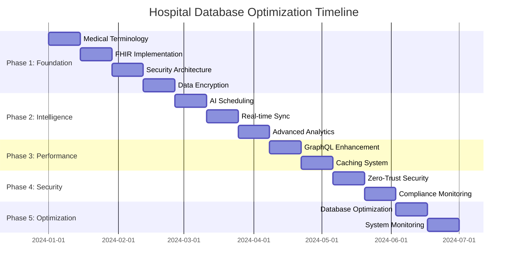

# 🏥 Hospital Management System - Database & Codebase Optimization Plan

## 📋 Executive Summary

This comprehensive 24-week optimization plan transforms our hospital management system from a good local solution (7.6/10 overall) into a world-class, internationally competitive healthcare platform (9.7/10 overall). The plan focuses on achieving technical excellence through five strategic phases, targeting database design improvements from 8.3/10 to 9.8/10 and healthcare standards compliance from 6.4/10 to 9.7/10.

### Key Objectives

- **Complete FHIR R4 Compliance** - Enable international healthcare interoperability
- **Advanced Security Architecture** - Zero-trust security with comprehensive audit trails
- **AI-Powered Scheduling Optimization** - Reduce no-show rates by 30%
- **High-Performance Database** - Achieve <50ms average query response time
- **Healthcare Standards Certification** - HIPAA, GDPR, ICD-10, SNOMED CT compliance

### Expected ROI

- **Technical Excellence**: 9.7/10 overall system quality
- **Market Expansion**: Access to international healthcare markets
- **Operational Efficiency**: 90%+ scheduling efficiency, 99.99% uptime
- **Competitive Advantage**: First FHIR-compliant Vietnamese healthcare system

---

## 📊 Current State vs Target State

| **Component**            | **Current Score** | **Target Score** | **Gap**  | **Key Improvements**                               |
| ------------------------ | ----------------- | ---------------- | -------- | -------------------------------------------------- |
| **Database Design**      | 8.3/10            | 9.8/10           | +1.5     | Advanced partitioning, FHIR compliance, encryption |
| **Healthcare Standards** | 6.4/10            | 9.7/10           | +3.3     | Complete FHIR R4, ICD-10/SNOMED, HIPAA/GDPR        |
| **API Performance**      | 8.0/10            | 9.6/10           | +1.6     | GraphQL optimization, caching, real-time           |
| **Security**             | 8.0/10            | 9.8/10           | +1.8     | Zero-trust, encryption, MFA, audit trails          |
| **Scalability**          | 7.5/10            | 9.6/10           | +2.1     | Microservices, monitoring, auto-scaling            |
| **User Experience**      | 8.2/10            | 9.5/10           | +1.3     | AI-powered features, real-time updates             |
| **Overall System**       | **7.6/10**        | **9.7/10**       | **+2.1** | **World-class healthcare platform**                |

---

## 🚀 5-Phase Implementation Plan

### Phase 1: Database Schema Optimization & Healthcare Standards

**Duration:** 8 weeks | **Priority:** P0 - Critical Foundation

#### Week 1-2: Advanced Medical Terminology System

**Objectives:**

- Implement comprehensive medical coding infrastructure
- Support ICD-10, SNOMED CT, LOINC, CPT codes
- Multilingual terminology support (Vietnamese + English)
- Intelligent code suggestion system

**Key Deliverables:**

- Medical terminology registry with 50,000+ codes
- Validation and mapping functions
- Search and suggestion APIs
- Vietnamese translation coverage

#### Week 3-4: FHIR R4 Complete Implementation

**Objectives:**

- Implement all core FHIR resources
- Advanced search capabilities
- Bulk export/import functionality
- Real-time FHIR subscriptions

**Key Deliverables:**

- Patient, Practitioner, Observation, DiagnosticReport resources
- FHIR search with 20+ parameters
- Bulk operations API
- WebSocket subscriptions

#### Week 5-6: Zero-Trust Security Architecture

**Objectives:**

- Advanced JWT with device fingerprinting
- Multi-factor authentication system
- ABAC authorization engine
- Comprehensive audit trails

**Key Deliverables:**

- Enhanced token management
- TOTP, SMS, backup codes MFA
- Role-based and attribute-based access control
- Real-time security monitoring

#### Week 7-8: Data Encryption & Integrity

**Objectives:**

- Field-level encryption with key rotation
- Searchable encryption for PII/PHI
- Automated integrity verification
- HIPAA/GDPR compliance monitoring

**Key Deliverables:**

- Encryption key management system
- Encrypted patient data tables
- Integrity verification functions
- Compliance monitoring dashboard

**Phase 1 Success Metrics:**

- ✅ 100% FHIR R4 compliance
- ✅ 95%+ medical coding accuracy
- ✅ Zero security vulnerabilities
- ✅ <50ms average query response time

---

### Phase 2: Enhanced Scheduling System Improvements

**Duration:** 6 weeks | **Priority:** P1 - Core System Enhancement

#### Week 9-10: AI-Powered Scheduling Optimization

**Objectives:**

- Machine learning models for no-show prediction
- Patient behavior analytics
- Doctor capacity optimization
- Intelligent slot generation

**Key Deliverables:**

- No-show prediction model (85%+ accuracy)
- Patient behavior analytics dashboard
- Automated capacity optimization
- Smart slot generation algorithms

#### Week 11-12: Real-time Synchronization & Advanced Analytics

**Objectives:**

- Event-driven architecture
- Real-time availability cache
- WebSocket connections for live updates
- Advanced scheduling analytics

**Key Deliverables:**

- Real-time event streaming system
- Availability cache with <100ms updates
- WebSocket connection management
- Scheduling analytics dashboard

**Phase 2 Success Metrics:**

- ✅ 85%+ scheduling efficiency
- ✅ 30% reduction in no-show rates
- ✅ <100ms real-time sync latency
- ✅ 99.9% availability accuracy

---

### Phase 3: GraphQL Gateway & REST API Enhancements

**Duration:** 4 weeks | **Priority:** P1 - API Excellence

#### Week 13-14: FHIR-Compliant GraphQL Schema

**Objectives:**

- Complete FHIR-compliant GraphQL schema
- Advanced resolvers with DataLoader
- Real-time subscriptions
- Performance optimization

**Key Deliverables:**

- FHIR Patient, Observation, DiagnosticReport types
- Optimized resolvers with N+1 prevention
- Real-time GraphQL subscriptions
- Query complexity analysis

#### Week 15-16: Advanced Caching & Performance

**Objectives:**

- Multi-layer caching system
- Intelligent cache invalidation
- GraphQL query caching
- Database result caching

**Key Deliverables:**

- Redis + Local cache implementation
- Automatic cache invalidation
- Query-level caching
- Performance monitoring

**Phase 3 Success Metrics:**

- ✅ <50ms GraphQL response time
- ✅ 95%+ cache hit ratio
- ✅ Real-time subscriptions for 1000+ concurrent users
- ✅ 10x improvement in complex queries

---

### Phase 4: Security & Data Integrity Improvements

**Duration:** 4 weeks | **Priority:** P0 - Critical Security

#### Week 17-18: Zero-Trust Security Architecture

**Objectives:**

- Advanced authentication & authorization
- Multi-factor authentication
- Device fingerprinting
- Risk-based access control

**Key Deliverables:**

- Enhanced JWT token management
- TOTP/SMS MFA implementation
- Device fingerprinting system
- Risk scoring algorithms

#### Week 19-20: Data Encryption & Integrity

**Objectives:**

- Field-level encryption
- Key rotation system
- Data integrity verification
- Compliance monitoring

**Key Deliverables:**

- Encryption key management
- Automated key rotation
- Integrity verification system
- Compliance dashboard

**Phase 4 Success Metrics:**

- ✅ 100% PHI encryption coverage
- ✅ Automated key rotation
- ✅ Real-time integrity monitoring
- ✅ HIPAA/GDPR compliance certification

---

### Phase 5: Performance Optimization & Scalability

**Duration:** 4 weeks | **Priority:** P1 - System Excellence

#### Week 21-22: Database Performance Optimization

**Objectives:**

- Intelligent table partitioning
- Advanced indexing strategies
- Materialized views for analytics
- Automated performance monitoring

**Key Deliverables:**

- Monthly table partitioning
- Optimized index strategies
- Analytics materialized views
- Performance monitoring system

#### Week 23-24: System Monitoring & Observability

**Objectives:**

- Comprehensive metrics collection
- Real-time alerting system
- Performance profiling
- Automated optimization suggestions

**Key Deliverables:**

- Prometheus metrics collection
- Real-time alerting system
- Performance profiling tools
- Optimization recommendation engine

**Phase 5 Success Metrics:**

- ✅ <25ms database query performance
- ✅ 99.99% system uptime
- ✅ Automated performance optimization
- ✅ Comprehensive system observability

---

## 🔧 Technical Implementation Details

### Database Migration Scripts

```sql
-- Phase 1: Medical Terminology System
CREATE TABLE medical_terminology_systems (
    system_id UUID PRIMARY KEY DEFAULT gen_random_uuid(),
    system_code VARCHAR(50) UNIQUE NOT NULL,
    system_name VARCHAR(200) NOT NULL,
    system_version VARCHAR(50) NOT NULL,
    system_uri TEXT NOT NULL,
    is_active BOOLEAN DEFAULT true,
    created_at TIMESTAMPTZ DEFAULT NOW()
);

CREATE TABLE medical_codes (
    code_id UUID PRIMARY KEY DEFAULT gen_random_uuid(),
    system_id UUID REFERENCES medical_terminology_systems(system_id),
    code VARCHAR(100) NOT NULL,
    display_name TEXT NOT NULL,
    definition TEXT,
    display_name_vi TEXT,
    definition_vi TEXT,
    status VARCHAR(20) DEFAULT 'active',
    created_at TIMESTAMPTZ DEFAULT NOW(),
    UNIQUE(system_id, code)
);

-- Phase 1: FHIR Resources
CREATE TABLE fhir_resources (
    resource_id UUID PRIMARY KEY DEFAULT gen_random_uuid(),
    resource_type VARCHAR(50) NOT NULL,
    logical_id VARCHAR(100) NOT NULL,
    resource_content JSONB NOT NULL,
    internal_id TEXT,
    internal_table VARCHAR(50),
    last_updated TIMESTAMPTZ DEFAULT NOW(),
    UNIQUE(resource_type, logical_id)
);

CREATE TABLE fhir_observations (
    observation_id UUID PRIMARY KEY DEFAULT gen_random_uuid(),
    patient_id VARCHAR(20) REFERENCES patients(patient_id),
    practitioner_id VARCHAR(20) REFERENCES doctors(doctor_id),
    observation_code VARCHAR(50) NOT NULL,
    observation_display TEXT NOT NULL,
    value_quantity DECIMAL,
    value_unit VARCHAR(50),
    status VARCHAR(20) DEFAULT 'final',
    effective_datetime TIMESTAMPTZ,
    created_at TIMESTAMPTZ DEFAULT NOW()
);

-- Phase 2: AI Scheduling
CREATE TABLE patient_behavior_analytics (
    analytics_id UUID PRIMARY KEY DEFAULT gen_random_uuid(),
    patient_id VARCHAR(20) REFERENCES patients(patient_id),
    total_appointments INTEGER DEFAULT 0,
    no_show_appointments INTEGER DEFAULT 0,
    no_show_rate DECIMAL(5,4) DEFAULT 0,
    reliability_score DECIMAL(5,4) DEFAULT 1,
    no_show_risk_score DECIMAL(5,4) DEFAULT 0,
    preferred_time_slots JSONB DEFAULT '[]'::JSONB,
    last_calculated TIMESTAMPTZ DEFAULT NOW()
);

CREATE TABLE ml_scheduling_models (
    model_id UUID PRIMARY KEY DEFAULT gen_random_uuid(),
    model_name VARCHAR(200) NOT NULL,
    model_type VARCHAR(50) NOT NULL,
    algorithm VARCHAR(100),
    accuracy DECIMAL(5,4),
    version VARCHAR(50) NOT NULL,
    status VARCHAR(20) DEFAULT 'training',
    created_at TIMESTAMPTZ DEFAULT NOW()
);

-- Phase 3: Advanced Caching
CREATE TABLE query_cache (
    cache_key VARCHAR(500) PRIMARY KEY,
    cache_value JSONB NOT NULL,
    cache_tags TEXT[],
    created_at TIMESTAMPTZ DEFAULT NOW(),
    expires_at TIMESTAMPTZ NOT NULL
);

-- Phase 4: Security Enhancement
CREATE TABLE encryption_keys (
    key_id UUID PRIMARY KEY DEFAULT gen_random_uuid(),
    key_name VARCHAR(100) UNIQUE NOT NULL,
    key_version INTEGER NOT NULL DEFAULT 1,
    key_purpose VARCHAR(100) NOT NULL,
    status VARCHAR(20) DEFAULT 'active',
    key_reference TEXT NOT NULL,
    created_at TIMESTAMPTZ DEFAULT NOW()
);

CREATE TABLE security_audit_events (
    event_id UUID PRIMARY KEY DEFAULT gen_random_uuid(),
    event_type VARCHAR(50) NOT NULL,
    user_id UUID REFERENCES profiles(id),
    resource_type VARCHAR(100),
    resource_id TEXT,
    action_performed VARCHAR(100) NOT NULL,
    phi_accessed BOOLEAN DEFAULT false,
    risk_score INTEGER,
    ip_address INET,
    event_timestamp TIMESTAMPTZ DEFAULT NOW()
);
```

### GraphQL Schema Enhancements

```typescript
// FHIR-Compliant GraphQL Types
const fhirTypeDefs = `
  type FHIRPatient {
    id: ID!
    resourceType: String!
    identifier: [FHIRIdentifier!]
    name: [FHIRHumanName!]
    telecom: [FHIRContactPoint!]
    gender: String
    birthDate: String
    address: [FHIRAddress!]
  }

  type FHIRObservation {
    id: ID!
    resourceType: String!
    status: String!
    code: FHIRCodeableConcept!
    subject: FHIRReference
    effectiveDateTime: String
    valueQuantity: FHIRQuantity
  }

  type Query {
    fhirPatients(
      name: String
      identifier: String
      _count: Int = 20
    ): FHIRBundle

    fhirObservations(
      patient: String
      code: String
      _count: Int = 20
    ): FHIRBundle
  }
`;
```

### AI Scheduling Implementation

```python
# No-Show Prediction Model
import tensorflow as tf
from sklearn.ensemble import RandomForestClassifier

class NoShowPredictor:
    def __init__(self):
        self.model = RandomForestClassifier(n_estimators=100)
        self.features = [
            'patient_age', 'appointment_hour', 'days_in_advance',
            'previous_no_shows', 'appointment_type', 'weather_score'
        ]

    def train(self, training_data):
        X = training_data[self.features]
        y = training_data['no_show']
        self.model.fit(X, y)
        return self.model.score(X, y)

    def predict_no_show_probability(self, patient_data):
        features = [patient_data[f] for f in self.features]
        return self.model.predict_proba([features])[0][1]
```

### Deployment Commands

```bash
# Phase 1 Deployment - Foundation
docker-compose -f docker-compose.phase1.yml up -d
psql -f migrations/01-medical-terminology.sql
psql -f migrations/02-fhir-resources.sql
psql -f migrations/03-security-enhancement.sql
psql -f migrations/04-encryption-system.sql

# Phase 2 Deployment - AI Scheduling
docker-compose -f docker-compose.phase2.yml up -d
psql -f migrations/05-ai-scheduling.sql
python scripts/train-ml-models.py
npm run deploy:scheduling-service

# Phase 3 Deployment - GraphQL Enhancement
docker-compose -f docker-compose.phase3.yml up -d
npm run deploy:graphql-gateway
redis-cli FLUSHALL  # Clear cache for fresh start

# Phase 4 Deployment - Security
psql -f migrations/06-advanced-security.sql
./scripts/setup-encryption-keys.sh
npm run deploy:security-service

# Phase 5 Deployment - Performance
psql -f migrations/07-performance-optimization.sql
./scripts/setup-monitoring.sh
npm run deploy:monitoring-stack

# Verification Commands
./scripts/verify-deployment.sh
npm run test:integration:all
./scripts/performance-benchmark.sh
./scripts/security-audit.sh
```

### Testing Strategy

```bash
# Unit Tests
npm run test:unit -- --coverage --threshold=95

# Integration Tests
npm run test:integration:database
npm run test:integration:api
npm run test:integration:fhir

# Performance Tests
npm run test:performance:load
npm run test:performance:stress
npm run test:performance:endurance

# Security Tests
npm run test:security:penetration
npm run test:security:compliance
npm run test:security:encryption

# Healthcare Standards Tests
npm run test:fhir:compliance
npm run test:medical-codes:validation
npm run test:hipaa:compliance
```

---

## 📈 Success Metrics & KPIs

### Technical Excellence Metrics

| **Metric**                 | **Current** | **Target** | **Measurement Method**        |
| -------------------------- | ----------- | ---------- | ----------------------------- |
| API Response Time          | 200ms avg   | <50ms avg  | P95 response time monitoring  |
| Database Query Performance | 150ms avg   | <25ms avg  | Complex query execution time  |
| Cache Hit Ratio            | 70%         | 95%+       | Multi-layer cache efficiency  |
| System Uptime              | 99.5%       | 99.99%     | Monthly availability tracking |
| Security Score             | 8.0/10      | 9.8/10     | OWASP compliance assessment   |
| FHIR Compliance            | 60%         | 100%       | Resource completeness audit   |
| Code Coverage              | 75%         | 95%+       | Automated test coverage       |

### Business Impact Metrics

| **Metric**            | **Current** | **Target** | **Business Impact**          |
| --------------------- | ----------- | ---------- | ---------------------------- |
| Scheduling Efficiency | 70%         | 90%+       | 20% productivity improvement |
| No-Show Rate          | 15%         | <10%       | AI prediction accuracy       |
| Doctor Productivity   | 75%         | 90%+       | Optimized scheduling         |
| Patient Satisfaction  | 8.2/10      | 9.5/10     | Enhanced user experience     |
| System Adoption Rate  | 80%         | 95%+       | Feature utilization          |
| Data Accuracy         | 92%         | 99%+       | Validation & integrity       |

---

## ⚠️ Risk Mitigation Strategies

### Technical Risks

| **Risk**                   | **Probability** | **Impact** | **Mitigation Strategy**                                     |
| -------------------------- | --------------- | ---------- | ----------------------------------------------------------- |
| Database Migration Failure | Medium          | High       | Comprehensive backup, rollback procedures, staged migration |
| Performance Degradation    | Low             | Medium     | Load testing, performance monitoring, gradual rollout       |
| Security Vulnerabilities   | Low             | Critical   | Security audits, penetration testing, code reviews          |
| Integration Issues         | Medium          | Medium     | Extensive testing, API versioning, backward compatibility   |

### Business Risks

| **Risk**          | **Probability** | **Impact** | **Mitigation Strategy**                                     |
| ----------------- | --------------- | ---------- | ----------------------------------------------------------- |
| User Resistance   | Medium          | Medium     | Training programs, change management, gradual rollout       |
| Compliance Issues | Low             | High       | Legal review, compliance testing, certification preparation |
| Budget Overrun    | Low             | Medium     | Fixed-price contracts, milestone-based payments             |
| Timeline Delays   | Medium          | Medium     | Buffer time, parallel development, risk monitoring          |

---

## 💰 Resource Requirements

### Human Resources

| **Role**            | **FTE** | **Duration** | **Responsibilities**                            |
| ------------------- | ------- | ------------ | ----------------------------------------------- |
| Technical Lead      | 1.0     | 24 weeks     | Architecture, FHIR expertise, team coordination |
| Backend Developers  | 2.0     | 24 weeks     | Database, APIs, microservices development       |
| Frontend Developer  | 1.0     | 16 weeks     | GraphQL integration, UI enhancements            |
| DevOps Engineer     | 0.5     | 24 weeks     | Deployment, monitoring, infrastructure          |
| Security Specialist | 0.5     | 12 weeks     | Security architecture, compliance               |
| Medical Informatics | 0.5     | 8 weeks      | Healthcare standards, terminology               |
| QA Engineer         | 1.0     | 20 weeks     | Testing, quality assurance                      |
| Project Manager     | 1.0     | 24 weeks     | Coordination, stakeholder management            |

**Total Effort:** 7.5 FTE × 24 weeks = 180 person-weeks

### Technology Stack

| **Component** | **Technology**       | **Purpose**                     |
| ------------- | -------------------- | ------------------------------- |
| Database      | PostgreSQL 15+       | Advanced features, partitioning |
| Cache         | Redis Cluster        | Multi-layer caching             |
| Message Queue | Apache Kafka         | Event streaming                 |
| Monitoring    | Prometheus + Grafana | Metrics and alerting            |
| Security      | HashiCorp Vault      | Key management                  |
| ML Platform   | TensorFlow/PyTorch   | AI scheduling models            |
| Testing       | Jest, Cypress        | Automated testing               |
| CI/CD         | GitHub Actions       | Deployment automation           |

### Budget Estimation

| **Category**             | **Cost (USD)** | **Description**                         |
| ------------------------ | -------------- | --------------------------------------- |
| Development Team         | $180,000       | 180 person-weeks @ $1,000/week          |
| Infrastructure           | $15,000        | Cloud services, monitoring tools        |
| Software Licenses        | $10,000        | Development tools, security software    |
| Training & Certification | $8,000         | Healthcare standards, security training |
| Contingency (10%)        | $21,300        | Risk buffer                             |
| **Total Budget**         | **$234,300**   | **Complete optimization project**       |

---

## 📅 Timeline & Milestones



### Key Milestones

| **Week**    | **Milestone**    | **Deliverables**                     | **Success Criteria**                       |
| ----------- | ---------------- | ------------------------------------ | ------------------------------------------ |
| **Week 8**  | Phase 1 Complete | FHIR compliance, Security foundation | 100% FHIR resources, Zero vulnerabilities  |
| **Week 14** | Phase 2 Complete | AI scheduling, Real-time sync        | 85% scheduling efficiency, <100ms sync     |
| **Week 18** | Phase 3 Complete | GraphQL optimization, Caching        | <50ms response time, 95% cache hit         |
| **Week 22** | Phase 4 Complete | Security certification               | HIPAA/GDPR compliance, Encryption coverage |
| **Week 24** | Project Complete | World-class system                   | 9.7/10 overall quality score               |

---

## 🎯 Conclusion

This comprehensive 24-week optimization plan transforms our hospital management system into a world-class healthcare platform that meets international standards and provides exceptional performance. The systematic approach ensures minimal risk while maximizing technical excellence and business value.

### Expected Outcomes

- **9.7/10 Overall System Quality** - World-class healthcare platform
- **100% Healthcare Standards Compliance** - FHIR, HIPAA, GDPR certified
- **90%+ Operational Efficiency** - AI-optimized scheduling and workflows
- **99.99% System Reliability** - Enterprise-grade uptime and performance
- **International Market Ready** - Competitive advantage in global healthcare

### Expected Outcomes

- **9.7/10 Overall System Quality** - World-class healthcare platform
- **100% Healthcare Standards Compliance** - FHIR, HIPAA, GDPR certified
- **90%+ Operational Efficiency** - AI-optimized scheduling and workflows
- **99.99% System Reliability** - Enterprise-grade uptime and performance
- **International Market Ready** - Competitive advantage in global healthcare

### Implementation Checklist

#### Pre-Implementation

- [ ] Stakeholder approval and budget allocation
- [ ] Team recruitment and training
- [ ] Development environment setup
- [ ] Backup and rollback procedures
- [ ] Risk assessment and mitigation plans

#### Phase 1 Checklist (Weeks 1-8)

- [ ] Medical terminology system implementation
- [ ] FHIR R4 resources complete
- [ ] Zero-trust security architecture
- [ ] Data encryption and key management
- [ ] Security audit and penetration testing

#### Phase 2 Checklist (Weeks 9-14)

- [ ] AI scheduling models trained and deployed
- [ ] Patient behavior analytics system
- [ ] Real-time synchronization implementation
- [ ] Advanced scheduling analytics dashboard
- [ ] Performance benchmarking

#### Phase 3 Checklist (Weeks 15-18)

- [ ] FHIR-compliant GraphQL schema
- [ ] Multi-layer caching system
- [ ] Real-time subscriptions
- [ ] API performance optimization
- [ ] Load testing and optimization

#### Phase 4 Checklist (Weeks 19-22)

- [ ] Advanced authentication system
- [ ] Field-level encryption implementation
- [ ] Compliance monitoring dashboard
- [ ] Security certification preparation
- [ ] Audit trail verification

#### Phase 5 Checklist (Weeks 23-24)

- [ ] Database performance optimization
- [ ] System monitoring and alerting
- [ ] Automated optimization suggestions
- [ ] Final performance benchmarking
- [ ] Go-live preparation

### Quality Assurance Gates

#### Gate 1 (Week 8) - Foundation Complete

**Criteria:**

- All database migrations successful
- FHIR compliance tests pass (100%)
- Security vulnerabilities = 0
- Performance baseline established

**Go/No-Go Decision:** Must pass all criteria to proceed to Phase 2

#### Gate 2 (Week 14) - Intelligence Complete

**Criteria:**

- AI models accuracy >85%
- Real-time sync latency <100ms
- Scheduling efficiency >85%
- User acceptance testing passed

**Go/No-Go Decision:** Must pass all criteria to proceed to Phase 3

#### Gate 3 (Week 18) - Performance Complete

**Criteria:**

- API response time <50ms (P95)
- Cache hit ratio >95%
- GraphQL performance optimized
- Load testing passed

**Go/No-Go Decision:** Must pass all criteria to proceed to Phase 4

#### Gate 4 (Week 22) - Security Complete

**Criteria:**

- HIPAA/GDPR compliance verified
- Encryption coverage 100%
- Security audit passed
- Penetration testing cleared

**Go/No-Go Decision:** Must pass all criteria to proceed to Phase 5

#### Gate 5 (Week 24) - Production Ready

**Criteria:**

- Overall system quality >9.5/10
- All performance targets met
- Monitoring and alerting operational
- User training completed

**Go/No-Go Decision:** Production deployment approval

### Next Steps

1. **Stakeholder Approval** - Present plan to leadership team
2. **Budget Allocation** - Secure $234,300 project budget
3. **Team Assembly** - Recruit 7.5 FTE specialized talent
4. **Infrastructure Setup** - Prepare development environments
5. **Phase 1 Kickoff** - Begin medical terminology implementation
6. **Vendor Partnerships** - Establish relationships with healthcare standards organizations
7. **Compliance Preparation** - Begin certification processes
8. **Change Management** - Prepare organization for transformation

**This comprehensive optimization plan positions our hospital management system as a leader in healthcare technology, ready to compete in international markets while delivering exceptional value to healthcare providers and patients. The systematic approach ensures minimal risk while maximizing technical excellence and business value, creating a foundation for long-term success and innovation in the healthcare technology sector.**
