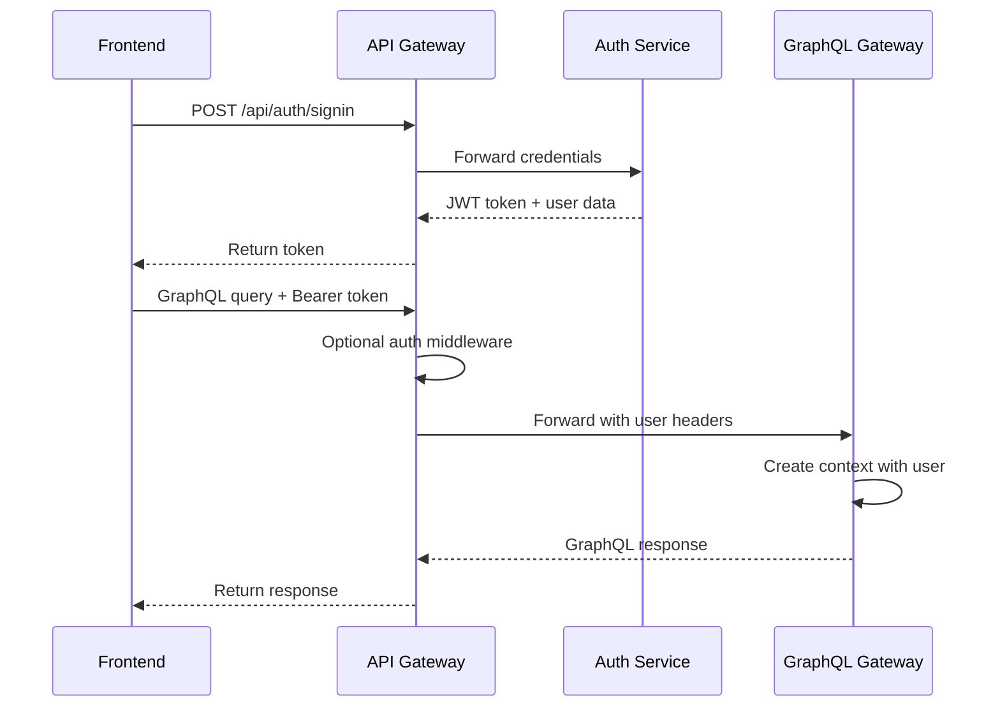

# 🏗️ Gateway Architecture Guide - Hospital Management System

## 📋 Tổng Quan Kiến Trúc

### Dual Gateway Pattern
Hệ thống sử dụng **Dual Gateway Pattern** với hai gateway chuyên biệt:

1. **API Gateway (Port 3100)** - Traffic Controller & Security Layer
2. **GraphQL Gateway (Port 3200)** - Data Orchestration & Query Optimization

## 🔐 API Gateway - Trách Nhiệm Chi Tiết

### Core Responsibilities
```typescript
// 1. Authentication & Authorization
app.use('/api/*', authMiddleware);
app.use('/graphql', optionalAuthMiddleware); // Smart auth for GraphQL

// 2. Rate Limiting
const limiter = rateLimit({
  windowMs: 15 * 60 * 1000, // 15 minutes
  max: 1000, // requests per IP
  message: 'Too many requests'
});

// 3. Request Routing
app.use('/api/doctors', proxy('http://doctor-service:3002'));
app.use('/api/patients', proxy('http://patient-service:3003'));
app.use('/graphql', proxy('http://graphql-gateway:3200'));
```

### Service Discovery & Health Monitoring
```typescript
// Service Registry với health checking
const serviceRegistry = new ServiceRegistry();
serviceRegistry.registerService('doctor-service', 'http://doctor-service:3002');

// Health check mỗi 30 giây
setInterval(async () => {
  await serviceRegistry.checkHealth();
}, 30000);
```

## 🔄 GraphQL Gateway - Data Orchestration

### Schema Stitching & DataLoaders
```typescript
// Kết hợp schemas từ nhiều services
export const typeDefs = [
  baseTypeDefs,
  doctorTypeDefs,
  patientTypeDefs,
  appointmentTypeDefs,
  departmentTypeDefs
];

// DataLoaders để tránh N+1 queries
const dataloaders = {
  doctorById: new DataLoader(batchLoadDoctors),
  patientsByDoctor: new DataLoader(batchLoadPatientsByDoctor),
  appointmentsByPatient: new DataLoader(batchLoadAppointmentsByPatient)
};
```

### Real-time Subscriptions
```typescript
// WebSocket support cho real-time updates
const wsLink = new GraphQLWsLink(
  createClient({
    url: 'ws://localhost:3100/graphql',
    connectionParams: () => ({
      authorization: `Bearer ${token}`
    })
  })
);
```

## 🎯 Frontend Integration Patterns

### 1. REST API Usage Patterns

#### Simple CRUD Operations
```typescript
// ✅ Sử dụng REST cho CRUD đơn giản
const doctorApi = {
  create: (data: DoctorForm) => apiClient.post('/api/doctors', data),
  update: (id: string, data: Partial<DoctorForm>) => 
    apiClient.put(`/api/doctors/${id}`, data),
  delete: (id: string) => apiClient.delete(`/api/doctors/${id}`)
};
```

#### File Uploads
```typescript
// ✅ REST cho file uploads
const uploadMedicalDocument = async (file: File, patientId: string) => {
  const formData = new FormData();
  formData.append('file', file);
  formData.append('patientId', patientId);
  
  return apiClient.post('/api/medical-records/documents', formData, {
    headers: { 'Content-Type': 'multipart/form-data' }
  });
};
```

#### Authentication Flows
```typescript
// ✅ REST cho authentication
const authApi = {
  login: (credentials: LoginData) => 
    apiClient.post('/api/auth/signin', credentials),
  logout: () => apiClient.post('/api/auth/signout'),
  refreshToken: () => apiClient.post('/api/auth/refresh')
};
```

### 2. GraphQL Usage Patterns

#### Complex Data Fetching
```typescript
// ✅ GraphQL cho complex queries với relationships
const GET_DOCTOR_DASHBOARD = gql`
  query GetDoctorDashboard($doctorId: ID!, $date: Date!) {
    doctor(id: $doctorId) {
      id
      name
      specialty
      department {
        name
        head {
          name
        }
      }
      todayAppointments: appointments(
        date: $date
        status: [SCHEDULED, IN_PROGRESS]
      ) {
        id
        scheduledAt
        status
        patient {
          id
          name
          age
          phone
          medicalHistory {
            allergies
            chronicConditions
          }
        }
        room {
          number
          type
        }
      }
      statistics {
        totalPatients
        todayAppointments
        completedToday
        pendingReviews
      }
    }
  }
`;
```

#### Real-time Updates
```typescript
// ✅ GraphQL Subscriptions cho real-time
const APPOINTMENT_UPDATES = gql`
  subscription OnAppointmentUpdate($doctorId: ID!) {
    appointmentUpdated(doctorId: $doctorId) {
      id
      status
      patient {
        name
        phone
      }
      scheduledAt
      updatedAt
    }
  }
`;

// Sử dụng trong component
const { data, loading } = useSubscription(APPOINTMENT_UPDATES, {
  variables: { doctorId: user.id }
});
```

#### Global Search
```typescript
// ✅ GraphQL cho search phức tạp
const GLOBAL_SEARCH = gql`
  query GlobalSearch($query: String!, $types: [SearchType!]) {
    globalSearch(query: $query, types: $types) {
      doctors {
        id
        name
        specialty
        department {
          name
        }
      }
      patients {
        id
        name
        phone
        lastVisit
      }
      appointments {
        id
        scheduledAt
        status
        doctor {
          name
        }
        patient {
          name
        }
      }
    }
  }
`;
```

## 🔧 Performance Optimization

### 1. Caching Strategy
```typescript
// Apollo Client cache configuration
const cache = new InMemoryCache({
  typePolicies: {
    Query: {
      fields: {
        doctors: {
          keyArgs: ["search", "departmentId"],
          merge(existing, incoming, { args }) {
            // Pagination merge logic
            if (!args?.offset || args.offset === 0) {
              return incoming;
            }
            return {
              ...incoming,
              edges: [...(existing?.edges || []), ...(incoming?.edges || [])]
            };
          }
        }
      }
    }
  }
});
```

### 2. Request Batching
```typescript
// DataLoader batching configuration
const doctorLoader = new DataLoader(
  async (ids: readonly string[]) => {
    return batchLoadDoctors(restApi, Array.from(ids));
  },
  {
    maxBatchSize: 100,
    batchScheduleFn: (callback) => setTimeout(callback, 10),
    cacheKeyFn: (key) => `doctor:${key}`
  }
);
```

### 3. Connection Pooling
```typescript
// API Gateway connection pooling
const agent = new http.Agent({
  keepAlive: true,
  maxSockets: 50,
  maxFreeSockets: 10,
  timeout: 60000
});
```

## 🛡️ Security Best Practices

### 1. Authentication Flow


### 2. Role-Based Access Control
```typescript
// GraphQL resolvers với role checking
export const doctorResolvers = {
  Query: {
    async sensitivePatientData(_, { patientId }, context) {
      // Check authentication
      if (!context.user) {
        throw new Error('Authentication required');
      }
      
      // Check authorization
      if (!['DOCTOR', 'ADMIN'].includes(context.user.role)) {
        throw new Error('Insufficient permissions');
      }
      
      // Additional checks for doctor-patient relationship
      if (context.user.role === 'DOCTOR') {
        const hasAccess = await checkDoctorPatientAccess(
          context.user.id, 
          patientId
        );
        if (!hasAccess) {
          throw new Error('Access denied to this patient');
        }
      }
      
      return await context.restApi.getPatientSensitiveData(patientId);
    }
  }
};
```

### 3. Input Validation & Sanitization
```typescript
// API Gateway input sanitization
app.use(sanitizeInput);

// GraphQL input validation
const CreateDoctorInput = new GraphQLInputObjectType({
  name: 'CreateDoctorInput',
  fields: {
    email: {
      type: new GraphQLNonNull(GraphQLString),
      validate: (value) => {
        if (!isEmail(value)) {
          throw new Error('Invalid email format');
        }
      }
    },
    licenseNumber: {
      type: new GraphQLNonNull(GraphQLString),
      validate: (value) => {
        if (!/^[A-Z0-9]{8,12}$/.test(value)) {
          throw new Error('Invalid license number format');
        }
      }
    }
  }
});
```

## 📊 Monitoring & Observability

### 1. Metrics Collection
```typescript
// API Gateway metrics
app.use(metricsMiddleware('api-gateway'));

// Custom metrics
const requestDuration = new prometheus.Histogram({
  name: 'http_request_duration_seconds',
  help: 'Duration of HTTP requests in seconds',
  labelNames: ['method', 'route', 'status_code']
});
```

### 2. Distributed Tracing
```typescript
// Request ID propagation
app.use((req, res, next) => {
  req.id = req.headers['x-request-id'] || generateRequestId();
  res.setHeader('x-request-id', req.id);
  next();
});

// Forward tracing headers
onProxyReq: (proxyReq, req) => {
  proxyReq.setHeader('x-request-id', req.id);
  proxyReq.setHeader('x-trace-id', req.headers['x-trace-id']);
}
```

### 3. Error Tracking
```typescript
// Structured error logging
const errorLink = onError(({ graphQLErrors, networkError, operation }) => {
  if (graphQLErrors) {
    graphQLErrors.forEach(({ message, locations, path, extensions }) => {
      logger.error('GraphQL Error', {
        message,
        path,
        operation: operation.operationName,
        variables: operation.variables,
        extensions
      });
    });
  }
  
  if (networkError) {
    logger.error('Network Error', {
      message: networkError.message,
      operation: operation.operationName,
      statusCode: networkError.statusCode
    });
  }
});
```

## 🚀 Deployment Considerations

### 1. Environment Configuration
```bash
# API Gateway
API_GATEWAY_PORT=3100
GRAPHQL_GATEWAY_URL=http://graphql-gateway:3200
AUTH_SERVICE_URL=http://auth-service:3001

# GraphQL Gateway
GRAPHQL_GATEWAY_PORT=3200
API_GATEWAY_URL=http://api-gateway:3100

# Frontend
NEXT_PUBLIC_API_GATEWAY_URL=http://localhost:3100
NEXT_PUBLIC_GRAPHQL_URL=http://localhost:3100/graphql
```

### 2. Load Balancing
```nginx
# Nginx configuration
upstream api_gateway {
    server api-gateway-1:3100;
    server api-gateway-2:3100;
    server api-gateway-3:3100;
}

upstream graphql_gateway {
    server graphql-gateway-1:3200;
    server graphql-gateway-2:3200;
}

server {
    listen 80;
    
    location /api/ {
        proxy_pass http://api_gateway;
        proxy_set_header Host $host;
        proxy_set_header X-Real-IP $remote_addr;
    }
    
    location /graphql {
        proxy_pass http://api_gateway;
        proxy_http_version 1.1;
        proxy_set_header Upgrade $http_upgrade;
        proxy_set_header Connection "upgrade";
    }
}
```

### 3. Health Checks
```typescript
// Kubernetes health checks
app.get('/health', (req, res) => {
  res.json({
    status: 'healthy',
    timestamp: new Date().toISOString(),
    uptime: process.uptime(),
    services: serviceRegistry.getHealthStatus()
  });
});

app.get('/ready', async (req, res) => {
  const isReady = await checkDependencies();
  res.status(isReady ? 200 : 503).json({
    ready: isReady,
    dependencies: await getDependencyStatus()
  });
});
```
