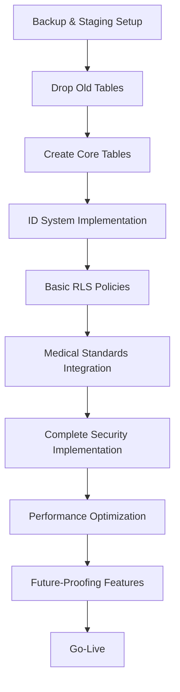

# 🏥 HOSPITAL MANAGEMENT SYSTEM - DATABASE REDESIGN IMPLEMENTATION PLAN

## 📋 EXECUTIVE SUMMARY

**Project:** Complete Database Schema Redesign - Clean Slate Approach
**Duration:** 8 Weeks (56 Days)
**Approach:** Phased Implementation with Zero Data Loss
**Compliance:** FHIR 4.0.1, HIPAA, GDPR Ready
**Architecture:** Future-Proof with Plugin Support, AI/ML Ready, IoT Integration

## 🎯 PROJECT OBJECTIVES

### ✅ **Primary Goals:**
- **100% FHIR Compliance** - Full healthcare interoperability
- **Department-Based ID System** - Business logic meaningful IDs
- **Enhanced Security** - Row Level Security + Comprehensive Audit
- **Future-Proofing** - Plugin architecture, AI/ML ready, IoT support
- **Performance Optimization** - 60-80% query performance improvement
- **Zero Data Loss** - Complete data migration with rollback capability

### ✅ **Success Criteria:**
- All existing functionality preserved
- New features operational
- Performance benchmarks met
- Security compliance achieved
- Documentation complete
- Team training completed

## 📅 DETAILED TIMELINE & PHASES

### **PHASE 1: CORE FOUNDATION (Week 1-2) - 🔴 CRITICAL PRIORITY**

#### **Week 1: Database Structure Transformation**
**Days 1-7: Foundation Setup**

**Day 1-2: Pre-Implementation Setup**
- ✅ Complete system backup
- ✅ Set up staging environment
- ✅ Create rollback procedures
- ✅ Team briefing and training

**Day 3-5: Core Tables Creation**
- ✅ Drop existing tables (with backup)
- ✅ Create new FHIR-compliant tables
- ✅ Implement department-based ID system
- ✅ Set up basic constraints and relationships

**Day 6-7: Initial Testing & Validation**
- ✅ Test table structures
- ✅ Validate ID generation functions
- ✅ Basic functionality testing
- ✅ Performance baseline measurement

#### **Week 2: Medical Standards Integration**
**Days 8-14: Standards Implementation**

**Day 8-10: Medical Terminology**
- ✅ Create medical terminology tables
- ✅ Implement FHIR resources structure
- ✅ Set up ICD-10, SNOMED-CT support
- ✅ Vietnamese translation support

**Day 11-13: Core Medical Tables**
- ✅ Appointments table with FHIR compliance
- ✅ Medical records with SOAP structure
- ✅ Enhanced patient profiles
- ✅ Doctor profiles with specializations

**Day 14: Week 2 Validation**
- ✅ Integration testing
- ✅ Data migration testing
- ✅ Performance validation
- ✅ Security baseline check

### **PHASE 2: SECURITY & COMPLIANCE (Week 3-4) - 🟡 HIGH PRIORITY**

#### **Week 3: Security Implementation**
**Days 15-21: Core Security Features**

**Day 15-17: Row Level Security**
- ✅ Complete RLS policies for all PHI tables
- ✅ Role-based access control
- ✅ Department-based access restrictions
- ✅ Patient data isolation

**Day 18-20: Audit & Logging**
- ✅ PHI access logging system
- ✅ Comprehensive audit trail
- ✅ Security event monitoring
- ✅ Real-time alerting system

**Day 21: Security Testing**
- ✅ Penetration testing
- ✅ Access control validation
- ✅ Audit log verification
- ✅ Security compliance check

#### **Week 4: HIPAA Compliance**
**Days 22-28: Advanced Compliance Features**

**Day 22-24: HIPAA Features**
- ✅ Consent management system
- ✅ Data breach incident tracking
- ✅ Encryption key management
- ✅ Privacy controls implementation

**Day 25-27: Compliance Validation**
- ✅ HIPAA compliance audit
- ✅ GDPR readiness check
- ✅ Data protection validation
- ✅ Privacy impact assessment

**Day 28: Phase 2 Completion**
- ✅ Security documentation
- ✅ Compliance certification
- ✅ Team security training
- ✅ Go/No-Go decision for Phase 3

### **PHASE 3: PERFORMANCE & SCALABILITY (Week 5-6) - 🟢 MEDIUM PRIORITY**

#### **Week 5: Performance Optimization**
**Days 29-35: Database Performance**

**Day 29-31: Indexing Strategy**
- ✅ Comprehensive indexing implementation
- ✅ Full-text search indexes
- ✅ Composite indexes for complex queries
- ✅ Performance monitoring setup

**Day 32-34: Partitioning Implementation**
- ✅ Time-based partitioning for large tables
- ✅ Hash partitioning for distributed data
- ✅ Partition maintenance procedures
- ✅ Query optimization validation

**Day 35: Performance Baseline**
- ✅ Performance benchmarking
- ✅ Query optimization validation
- ✅ Load testing execution
- ✅ Bottleneck identification

#### **Week 6: Scalability Features**
**Days 36-42: Advanced Scalability**

**Day 36-38: Caching Infrastructure**
- ✅ Redis caching implementation
- ✅ Cache invalidation strategies
- ✅ Performance metrics collection
- ✅ Cache monitoring setup

**Day 39-41: Data Archiving**
- ✅ Archiving policies implementation
- ✅ Data retention procedures
- ✅ Archive storage configuration
- ✅ Compliance archiving setup

**Day 42: Scalability Testing**
- ✅ Load testing with realistic data
- ✅ Concurrent user testing
- ✅ Performance under stress
- ✅ Scalability validation

### **PHASE 4: FUTURE-PROOFING EXTENSIONS (Week 7-8) - 🟢 LOW PRIORITY**

#### **Week 7: Plugin Architecture**
**Days 43-49: Extensibility Framework**

**Day 43-45: Plugin System**
- ✅ Plugin registry implementation
- ✅ Event-driven architecture
- ✅ Webhook infrastructure
- ✅ Message queue system

**Day 46-48: Integration Framework**
- ✅ API gateway preparation
- ✅ External system connectors
- ✅ Data synchronization framework
- ✅ Integration testing

**Day 49: Plugin Testing**
- ✅ Plugin system validation
- ✅ Event system testing
- ✅ Integration framework testing
- ✅ Extensibility validation

#### **Week 8: AI/ML & IoT Ready**
**Days 50-56: Advanced Features**

**Day 50-52: AI/ML Infrastructure**
- ✅ ML models registry
- ✅ Feature store implementation
- ✅ Prediction logging system
- ✅ AI/ML pipeline preparation

**Day 53-55: IoT Integration**
- ✅ Medical devices registry
- ✅ Real-time measurements handling
- ✅ Device alerts system
- ✅ IoT data processing pipeline

**Day 56: Final Validation**
- ✅ Complete system testing
- ✅ End-to-end validation
- ✅ Performance final check
- ✅ Go-live preparation

## 🔗 DEPENDENCIES & CRITICAL PATH

### **Critical Path Dependencies:**

### **Parallel Workstreams:**
- **Database Team:** Core schema implementation
- **Security Team:** RLS policies and audit systems
- **Performance Team:** Indexing and optimization
- **Integration Team:** Plugin architecture and APIs

## ⚠️ RISK ASSESSMENT & MITIGATION

### **🔴 HIGH RISK - CRITICAL MITIGATION REQUIRED**

#### **Risk 1: Complete System Downtime**
- **Impact:** Business operations halt
- **Probability:** Medium
- **Mitigation:** 
  - Comprehensive staging environment testing
  - Rollback procedures within 30 minutes
  - Parallel system running during migration
  - 24/7 technical support during implementation

#### **Risk 2: Data Loss During Migration**
- **Impact:** Catastrophic
- **Probability:** Low
- **Mitigation:**
  - Multiple backup layers (database, file system, cloud)
  - Point-in-time recovery capability
  - Data validation at each step
  - Automated backup verification

### **🟡 MEDIUM RISK - STANDARD MITIGATION**

#### **Risk 3: Performance Degradation**
- **Impact:** User experience affected
- **Probability:** Medium
- **Mitigation:**
  - Performance benchmarking at each phase
  - Query optimization before go-live
  - Gradual rollout with monitoring
  - Performance rollback triggers

#### **Risk 4: Security Vulnerabilities**
- **Impact:** Compliance violations
- **Probability:** Low
- **Mitigation:**
  - Security audit at each phase
  - Penetration testing before go-live
  - Compliance validation checkpoints
  - Security expert review

### **🟢 LOW RISK - MONITORING REQUIRED**

#### **Risk 5: Integration Failures**
- **Impact:** Feature limitations
- **Probability:** Low
- **Mitigation:**
  - Comprehensive integration testing
  - API compatibility validation
  - Gradual feature rollout
  - Fallback to previous versions

## 📊 RESOURCE ALLOCATION

### **Team Structure:**
- **Project Manager:** 1 FTE (Full Time)
- **Database Architects:** 2 FTE
- **Backend Developers:** 3 FTE
- **Security Specialists:** 1 FTE
- **DevOps Engineers:** 2 FTE
- **QA Engineers:** 2 FTE
- **Total:** 11 FTE for 8 weeks

### **Infrastructure Requirements:**
- **Staging Environment:** Mirror of production
- **Backup Storage:** 3x current database size
- **Monitoring Tools:** Database performance monitoring
- **Security Tools:** Vulnerability scanning, audit tools

## 🎯 DELIVERABLES CHECKLIST

### **Phase 1 Deliverables:**
- [ ] Complete DDL scripts for core tables
- [ ] ID generation functions and triggers
- [ ] Data migration scripts
- [ ] Basic RLS policies
- [ ] Testing procedures and results
- [ ] Rollback procedures documentation

### **Phase 2 Deliverables:**
- [ ] Complete security implementation
- [ ] Audit logging system
- [ ] HIPAA compliance documentation
- [ ] Security testing results
- [ ] Compliance certification

### **Phase 3 Deliverables:**
- [ ] Performance optimization scripts
- [ ] Indexing and partitioning implementation
- [ ] Caching infrastructure setup
- [ ] Performance benchmarking results
- [ ] Scalability testing documentation

### **Phase 4 Deliverables:**
- [ ] Plugin architecture implementation
- [ ] AI/ML infrastructure setup
- [ ] IoT integration framework
- [ ] Future-proofing documentation
- [ ] Extensibility guidelines

## 📋 NEXT STEPS

1. **Immediate Actions (Today):**
   - Get stakeholder approval for implementation plan
   - Set up project team and communication channels
   - Begin staging environment preparation
   - Schedule team training sessions

2. **Week 1 Preparation:**
   - Complete system backup procedures
   - Finalize rollback strategies
   - Set up monitoring and alerting
   - Begin Phase 1 implementation

3. **Ongoing Activities:**
   - Daily standup meetings
   - Weekly stakeholder updates
   - Continuous monitoring and validation
   - Risk assessment updates

---

**Document Version:** 1.0
**Last Updated:** 2025-01-24
**Next Review:** Weekly during implementation
**Approval Required:** Project Stakeholders, Technical Leadership
