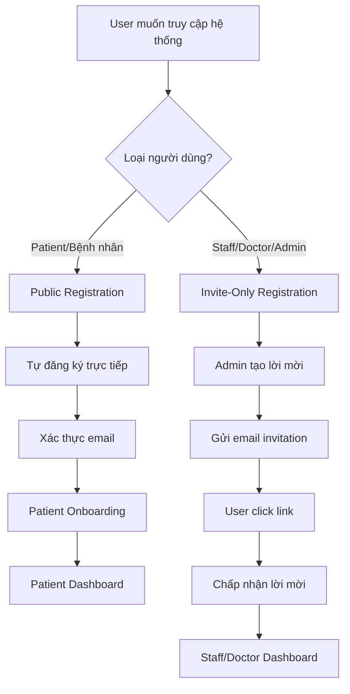

# 🔐 Dual Authentication System

Hospital Management System sử dụng **hai hệ thống authentication riêng biệt** cho hai nhóm người dùng khác nhau.

## 🏗️ Kiến trúc tổng quan



## 👥 Hai nhóm người dùng

### 🧑‍🤝‍🧑 **PATIENTS (Bệnh nhân)** - Public Registration

#### ✅ Đặc điểm:
- **Tự đăng ký** không cần lời mời
- **Quy trình onboarding** chi tiết
- **CAPTCHA verification** chống spam
- **Email verification** bắt buộc

#### 🔗 Endpoints:
- `POST /api/auth/register` - Đăng ký patient
- `POST /api/auth/onboarding` - Hoàn tất thông tin

#### 🎯 Frontend Routes:
- `/register` - Trang đăng ký patient
- `/onboarding` - Wizard hoàn tất thông tin

#### 📋 Quy trình:
1. **Truy cập** `/register`
2. **Điền form** cơ bản (email, password, họ tên)
3. **Xác thực CAPTCHA**
4. **Nhận email** xác thực
5. **Click link** trong email
6. **Hoàn tất onboarding** (địa chỉ, liên hệ khẩn cấp, bảo hiểm)
7. **Truy cập** patient dashboard

---

### 👨‍⚕️ **STAFF/DOCTOR/ADMIN** - Invite-Only Registration

#### ✅ Đặc điểm:
- **Chỉ theo lời mời** từ admin
- **Kiểm soát chặt chẽ** quyền truy cập
- **Bảo mật cao** với HMAC token
- **Không cần onboarding** phức tạp

#### 🔗 Endpoints:
- `POST /api/admin/invitations` - Tạo lời mời
- `POST /api/auth/verify-invite` - Xác thực token
- `POST /api/auth/accept-invite` - Chấp nhận lời mời

#### 🎯 Frontend Routes:
- `/admin/invitations` - Quản lý lời mời
- `/accept-invite?token=xxx` - Chấp nhận lời mời

#### 📋 Quy trình:
1. **Admin tạo lời mời** qua admin panel
2. **Hệ thống gửi email** với link bảo mật
3. **User click link** invitation
4. **Xác thực token** tự động
5. **Điền password** và đồng ý điều khoản
6. **Tạo tài khoản** ngay lập tức
7. **Truy cập** role-based dashboard

## 🔄 So sánh hai hệ thống

| Aspect | Patients | Staff/Doctor/Admin |
|--------|----------|-------------------|
| **Cách đăng ký** | Tự đăng ký | Chỉ theo lời mời |
| **Kiểm soát** | Công khai | Chặt chẽ |
| **CAPTCHA** | ✅ Bắt buộc | ❌ Không cần |
| **Email verification** | ✅ Bắt buộc | ✅ Tự động |
| **Onboarding** | ✅ Chi tiết | ❌ Tối giản |
| **Approval** | Tự động | Qua admin |
| **Security level** | Trung bình | Cao |

## 🛡️ Bảo mật

### Patient Registration Security:
- **Rate limiting**: 5 registrations/hour per IP
- **CAPTCHA verification**: Chống bot
- **Email verification**: Xác thực email thật
- **Password strength**: Yêu cầu mật khẩu mạnh
- **Input validation**: Sanitize tất cả input

### Staff Invitation Security:
- **HMAC-SHA256 tokens**: Không thể forge
- **Time-limited tokens**: Hết hạn sau 7-30 ngày
- **Single-use tokens**: Chỉ dùng một lần
- **Admin-only creation**: Chỉ admin mới tạo được
- **Audit logging**: Ghi log tất cả hoạt động

## 📱 Frontend Implementation

### Patient Registration Form:
```typescript
// /components/auth/PatientRegistrationForm.tsx
export function PatientRegistrationForm() {
  // Multi-step form với validation
  // CAPTCHA integration
  // Password strength indicator
  // Real-time email validation
}
```

### Staff Invitation Form:
```typescript
// /components/auth/InviteAcceptanceForm.tsx
export function InviteAcceptanceForm() {
  // Token verification
  // Simple password setup
  // Terms acceptance
  // Role-based redirect
}
```

## 🔧 Configuration

### Environment Variables:
```bash
# Patient Registration
CAPTCHA_SECRET_KEY=your-captcha-secret
NEXT_PUBLIC_CAPTCHA_SITE_KEY=your-captcha-site-key

# Email Service (cho cả hai hệ thống)
SMTP_HOST=smtp.gmail.com
SMTP_USER=your-email@gmail.com
SMTP_PASS=your-app-password

# Rate Limiting
RATE_LIMIT_REGISTER=5  # patients per hour
RATE_LIMIT_INVITE=10   # invitations per hour
```

## 🧪 Testing

### Test Patient Registration:
```bash
# Truy cập trang đăng ký
curl http://localhost:3000/register

# Test API endpoint
curl -X POST /api/auth/register \
  -H "Content-Type: application/json" \
  -d '{
    "email": "patient@test.com",
    "password": "Patient123!",
    "full_name": "Test Patient",
    "captcha_token": "test-token"
  }'
```

### Test Staff Invitation:
```bash
# Tạo lời mời (cần admin token)
curl -X POST /api/admin/invitations \
  -H "Authorization: Bearer <admin-token>" \
  -H "Content-Type: application/json" \
  -d '{
    "email": "doctor@test.com",
    "role": "doctor",
    "department_id": 1
  }'

# Chấp nhận lời mời
curl -X POST /api/auth/accept-invite \
  -H "Content-Type: application/json" \
  -d '{
    "token": "invitation-token",
    "password": "Doctor123!",
    "accept_tos": true,
    "accept_privacy": true
  }'
```

## 🎯 User Experience

### Patient Journey:
1. **Landing page** → "Đăng ký tài khoản"
2. **Registration form** → Điền thông tin cơ bản
3. **Email verification** → Check email và click link
4. **Onboarding wizard** → Hoàn tất profile
5. **Patient dashboard** → Đặt lịch khám, xem kết quả

### Staff Journey:
1. **Nhận email invitation** → "Bạn được mời tham gia"
2. **Click invitation link** → Tự động verify token
3. **Setup password** → Tạo mật khẩu mới
4. **Role-based dashboard** → Truy cập theo vai trò

## 🔮 Future Enhancements

### Patient Registration:
- [ ] Social login (Google, Facebook)
- [ ] SMS verification
- [ ] ID card scanning
- [ ] Insurance verification

### Staff Invitation:
- [ ] Bulk invitation creation
- [ ] Custom invitation templates
- [ ] Department-specific permissions
- [ ] Temporary access tokens

## 📊 Analytics & Monitoring

### Metrics to Track:
- **Patient registration rate**: Số đăng ký/ngày
- **Email verification rate**: % click email
- **Onboarding completion**: % hoàn tất wizard
- **Staff invitation acceptance**: % chấp nhận lời mời
- **Time to activation**: Thời gian từ invite đến active

### Database Queries:
```sql
-- Patient registration stats
SELECT 
  DATE(created_at) as date,
  COUNT(*) as registrations,
  COUNT(CASE WHEN email_verified = true THEN 1 END) as verified,
  COUNT(CASE WHEN onboarding_completed = true THEN 1 END) as completed
FROM profiles 
WHERE role = 'patient'
GROUP BY DATE(created_at);

-- Staff invitation stats  
SELECT 
  role,
  COUNT(*) as total_invitations,
  COUNT(consumed_at) as accepted,
  AVG(EXTRACT(EPOCH FROM (consumed_at - created_at))/3600) as avg_hours_to_accept
FROM staff_invitations
GROUP BY role;
```

## 🎉 Kết luận

Hệ thống dual authentication cho phép:
- **Patients**: Trải nghiệm đăng ký dễ dàng, tự do
- **Staff**: Bảo mật cao, kiểm soát chặt chẽ
- **Admins**: Quản lý linh hoạt, audit đầy đủ

Cả hai hệ thống đều **hoạt động song song** và **không xung đột** với nhau!
