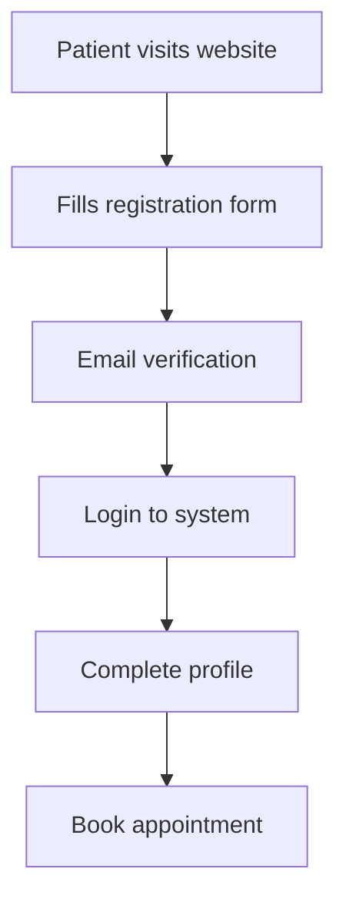
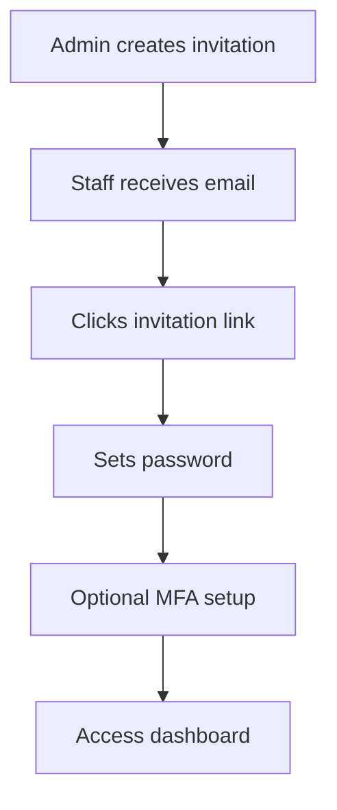
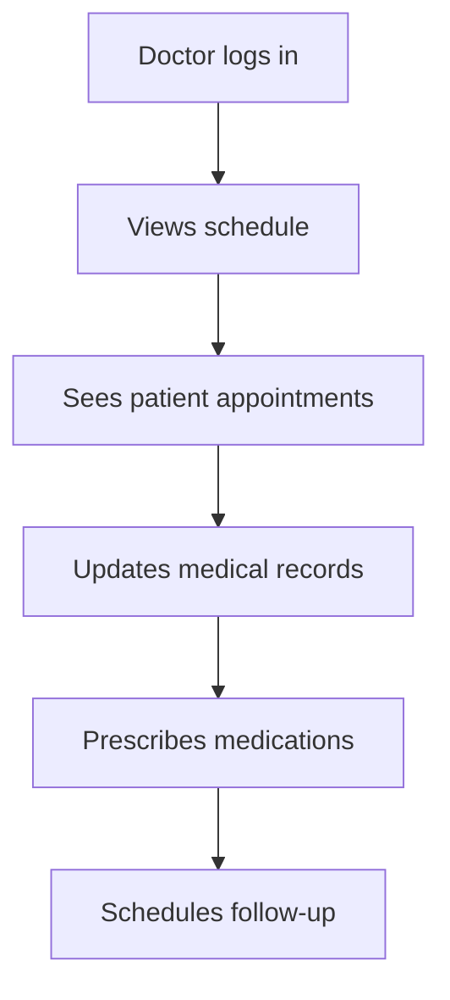

# Feature Gap Analysis & Development Roadmap

## 🎯 Current vs Target Feature Matrix

### ✅ Features Implemented in New Auth System

| Feature Category | Feature | Status | Coverage |
|------------------|---------|--------|----------|
| **Authentication** | Multi-role login | ✅ Complete | 100% |
| **Authentication** | Email verification | ✅ Complete | 100% |
| **Authentication** | Password reset | ✅ Complete | 100% |
| **Authentication** | MFA (TOTP) | ✅ Complete | 100% |
| **Authentication** | Session management | ✅ Complete | 100% |
| **User Management** | Patient registration | ✅ Complete | 100% |
| **User Management** | Staff invitations | ✅ Complete | 100% |
| **User Management** | Profile management | ✅ Complete | 100% |
| **User Management** | Role-based access | ✅ Complete | 100% |
| **Security** | Rate limiting | ✅ Complete | 100% |
| **Security** | CAPTCHA integration | ✅ Complete | 100% |
| **Security** | Audit logging | ✅ Complete | 100% |
| **Security** | File upload security | ✅ Complete | 100% |
| **Compliance** | GDPR consent management | ✅ Complete | 100% |
| **Compliance** | Data encryption | ✅ Complete | 100% |

### ❌ Missing Features (Require Development)

#### 🏥 Core Hospital Features

| Feature | Priority | Effort | Dependencies | Business Impact |
|---------|----------|--------|--------------|-----------------|
| **Appointment Scheduling** | Critical | 8-12 weeks | User management | High |
| **Medical Records Management** | Critical | 10-15 weeks | Authentication | High |
| **Doctor Availability** | High | 4-6 weeks | User management | Medium |
| **Patient-Doctor Messaging** | High | 6-8 weeks | Real-time features | Medium |
| **Prescription Management** | High | 8-10 weeks | Medical records | Medium |
| **Lab Results Integration** | Medium | 6-8 weeks | External APIs | Medium |
| **Imaging System Integration** | Medium | 8-12 weeks | External APIs | Low |

#### 💰 Business & Administrative Features

| Feature | Priority | Effort | Dependencies | Business Impact |
|---------|----------|--------|--------------|-----------------|
| **Billing & Payments** | Critical | 12-16 weeks | Patient data | High |
| **Insurance Claims** | High | 10-12 weeks | Billing system | High |
| **Inventory Management** | Medium | 8-10 weeks | User management | Medium |
| **Staff Scheduling** | Medium | 6-8 weeks | User management | Medium |
| **Reporting & Analytics** | High | 8-12 weeks | Data aggregation | High |
| **Department Management** | Low | 4-6 weeks | User management | Low |

#### 🔗 Integration Features

| Feature | Priority | Effort | Dependencies | Business Impact |
|---------|----------|--------|--------------|-----------------|
| **EMR/EHR Integration** | High | 12-20 weeks | External systems | High |
| **Laboratory System** | Medium | 8-12 weeks | External APIs | Medium |
| **Pharmacy System** | Medium | 6-10 weeks | External APIs | Medium |
| **Payment Gateway** | High | 4-6 weeks | Financial APIs | High |
| **SMS/Email Notifications** | Medium | 3-4 weeks | Third-party APIs | Medium |

## 📈 Development Effort Estimation

### Phase 1: Core Clinical Features (4-6 months)

#### Appointment Scheduling System
```typescript
// Estimated effort: 8-12 weeks
interface AppointmentSystem {
  // Core features
  scheduleAppointment(request: AppointmentRequest): Promise<Appointment>
  cancelAppointment(id: string): Promise<void>
  rescheduleAppointment(id: string, newTime: Date): Promise<Appointment>
  
  // Doctor availability
  getDoctorAvailability(doctorId: string, date: Date): Promise<TimeSlot[]>
  setDoctorSchedule(doctorId: string, schedule: Schedule): Promise<void>
  
  // Patient features
  getPatientAppointments(patientId: string): Promise<Appointment[]>
  searchAvailableSlots(criteria: SearchCriteria): Promise<TimeSlot[]>
}

// Database schema additions needed
/*
CREATE TABLE appointments (
  id UUID PRIMARY KEY DEFAULT uuid_generate_v4(),
  patient_id UUID REFERENCES profiles(id),
  doctor_id UUID REFERENCES profiles(id),
  appointment_date TIMESTAMPTZ NOT NULL,
  duration_minutes INTEGER DEFAULT 30,
  status appointment_status DEFAULT 'scheduled',
  notes TEXT,
  created_at TIMESTAMPTZ DEFAULT NOW()
);

CREATE TABLE doctor_schedules (
  id UUID PRIMARY KEY DEFAULT uuid_generate_v4(),
  doctor_id UUID REFERENCES profiles(id),
  day_of_week INTEGER, -- 0-6 (Sunday-Saturday)
  start_time TIME,
  end_time TIME,
  is_available BOOLEAN DEFAULT true
);
*/
```

#### Medical Records Management
```typescript
// Estimated effort: 10-15 weeks
interface MedicalRecordsSystem {
  // Patient records
  createMedicalRecord(record: MedicalRecordInput): Promise<MedicalRecord>
  updateMedicalRecord(id: string, updates: Partial<MedicalRecord>): Promise<MedicalRecord>
  getPatientRecords(patientId: string): Promise<MedicalRecord[]>
  
  // Doctor notes
  addDoctorNote(recordId: string, note: DoctorNote): Promise<void>
  updateDiagnosis(recordId: string, diagnosis: Diagnosis): Promise<void>
  
  // File attachments
  uploadMedicalDocument(recordId: string, file: File): Promise<Document>
  getMedicalDocuments(recordId: string): Promise<Document[]>
}

// Additional database tables needed
/*
CREATE TABLE medical_records (
  id UUID PRIMARY KEY DEFAULT uuid_generate_v4(),
  patient_id UUID REFERENCES profiles(id),
  doctor_id UUID REFERENCES profiles(id),
  appointment_id UUID REFERENCES appointments(id),
  chief_complaint TEXT,
  diagnosis TEXT[],
  treatment_plan TEXT,
  medications JSONB,
  created_at TIMESTAMPTZ DEFAULT NOW()
);

CREATE TABLE medical_documents (
  id UUID PRIMARY KEY DEFAULT uuid_generate_v4(),
  record_id UUID REFERENCES medical_records(id),
  file_name TEXT NOT NULL,
  file_path TEXT NOT NULL,
  file_type TEXT NOT NULL,
  uploaded_by UUID REFERENCES profiles(id),
  created_at TIMESTAMPTZ DEFAULT NOW()
);
*/
```

### Phase 2: Business Features (3-4 months)

#### Billing & Payment System
```typescript
// Estimated effort: 12-16 weeks
interface BillingSystem {
  // Invoice management
  createInvoice(appointmentId: string, services: BillingItem[]): Promise<Invoice>
  processPayment(invoiceId: string, payment: PaymentInfo): Promise<PaymentResult>
  
  // Insurance handling
  submitInsuranceClaim(invoiceId: string): Promise<ClaimResult>
  processInsuranceResponse(claimId: string, response: InsuranceResponse): Promise<void>
  
  // Reporting
  getFinancialReport(period: DateRange): Promise<FinancialReport>
  getPatientBilling(patientId: string): Promise<BillingHistory>
}
```

#### Reporting & Analytics
```typescript
// Estimated effort: 8-12 weeks
interface AnalyticsSystem {
  // Patient analytics
  getPatientStatistics(period: DateRange): Promise<PatientStats>
  getAppointmentMetrics(period: DateRange): Promise<AppointmentMetrics>
  
  // Financial analytics
  getRevenueReport(period: DateRange): Promise<RevenueReport>
  getPaymentAnalytics(period: DateRange): Promise<PaymentAnalytics>
  
  // Operational analytics
  getDoctorPerformance(period: DateRange): Promise<DoctorPerformance[]>
  getSystemUsageMetrics(period: DateRange): Promise<UsageMetrics>
}
```

### Phase 3: Advanced Features (2-3 months)

#### Real-time Communication
```typescript
// Estimated effort: 6-8 weeks
interface CommunicationSystem {
  // Patient-Doctor messaging
  sendMessage(from: string, to: string, message: Message): Promise<void>
  getConversation(patientId: string, doctorId: string): Promise<Message[]>
  
  // Notifications
  sendAppointmentReminder(appointmentId: string): Promise<void>
  notifyLabResults(patientId: string, results: LabResults): Promise<void>
  
  // Video consultation (future)
  initiateVideoCall(appointmentId: string): Promise<VideoSession>
  joinVideoCall(sessionId: string): Promise<void>
}
```

## 🔄 Migration Impact on User Workflows

### Current Workflow Analysis

#### Patient Registration Workflow


**New System Impact:**
- ✅ **Improved**: CAPTCHA security, better validation
- ✅ **Enhanced**: Progressive onboarding wizard
- ✅ **Added**: Consent management, document upload
- ⚠️ **Missing**: Appointment booking (needs development)

#### Staff Onboarding Workflow


**New System Impact:**
- ✅ **Improved**: Secure invitation system
- ✅ **Enhanced**: MFA support, better security
- ✅ **Added**: Role-based access control
- ✅ **Maintained**: All existing functionality

#### Doctor Daily Workflow


**New System Impact:**
- ✅ **Improved**: Faster, more secure login
- ❌ **Missing**: Schedule management (needs development)
- ❌ **Missing**: Medical records system (needs development)
- ❌ **Missing**: Prescription system (needs development)

## 📊 Feature Development Priority Matrix

### Priority Scoring Criteria
- **Business Impact**: 1-5 (5 = Critical for operations)
- **User Impact**: 1-5 (5 = Affects all users daily)
- **Technical Complexity**: 1-5 (5 = Very complex)
- **Dependencies**: 1-5 (5 = Many dependencies)

| Feature | Business | User | Complexity | Dependencies | Total Score | Priority |
|---------|----------|------|------------|--------------|-------------|----------|
| **Appointment Scheduling** | 5 | 5 | 3 | 2 | 15 | 🔴 Critical |
| **Medical Records** | 5 | 4 | 4 | 3 | 16 | 🔴 Critical |
| **Billing System** | 5 | 3 | 4 | 3 | 15 | 🔴 Critical |
| **Patient-Doctor Messaging** | 3 | 4 | 3 | 2 | 12 | 🟡 High |
| **Reporting & Analytics** | 4 | 2 | 3 | 3 | 12 | 🟡 High |
| **Doctor Availability** | 4 | 4 | 2 | 2 | 12 | 🟡 High |
| **Insurance Claims** | 4 | 2 | 4 | 4 | 14 | 🟡 High |
| **Inventory Management** | 3 | 2 | 3 | 2 | 10 | 🟢 Medium |
| **Staff Scheduling** | 3 | 3 | 2 | 2 | 10 | 🟢 Medium |
| **EMR Integration** | 3 | 2 | 5 | 5 | 15 | 🟢 Medium |

## 🚀 Recommended Development Roadmap

### Immediate Phase (Months 1-2): Foundation
- ✅ **Complete**: Authentication system deployment
- 🔄 **Develop**: Basic appointment scheduling
- 🔄 **Develop**: Simple medical records

### Short-term Phase (Months 3-6): Core Features
- 🔄 **Develop**: Full appointment system with availability
- 🔄 **Develop**: Comprehensive medical records
- 🔄 **Develop**: Basic billing system
- 🔄 **Develop**: Patient-doctor messaging

### Medium-term Phase (Months 7-12): Business Features
- 🔄 **Develop**: Advanced billing & insurance
- 🔄 **Develop**: Reporting & analytics
- 🔄 **Develop**: Inventory management
- 🔄 **Integrate**: Payment gateways

### Long-term Phase (Months 13+): Advanced Features
- 🔄 **Develop**: EMR/EHR integrations
- 🔄 **Develop**: Advanced analytics
- 🔄 **Develop**: Mobile applications
- 🔄 **Develop**: AI-powered features

## 💡 Recommendations

### For Immediate Migration:
1. **Start with Authentication**: Deploy new auth system first
2. **Parallel Development**: Begin core feature development
3. **User Training**: Prepare staff for new interface
4. **Data Migration**: Plan patient data transfer

### For Feature Development:
1. **MVP Approach**: Start with basic versions of critical features
2. **User Feedback**: Gather feedback early and iterate
3. **Incremental Rollout**: Deploy features gradually
4. **Quality Assurance**: Extensive testing for medical features

### Risk Mitigation:
1. **Backup Plans**: Maintain legacy system during transition
2. **Training Programs**: Comprehensive user training
3. **Support System**: 24/7 support during critical phases
4. **Performance Monitoring**: Real-time system monitoring
