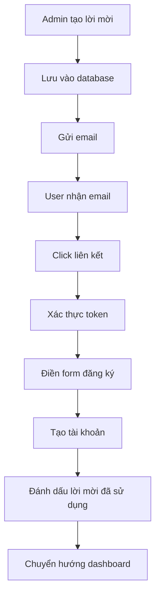

# 🎫 Invite-Only Authentication System

Hệ thống xác thực chỉ theo lời mời cho Hospital Management System, đảm bảo chỉ những người được ủy quyền mới có thể tạo tài khoản nhân viên.

## 📋 Tổng quan

Hệ thống invitation cho phép:
- **Admin** tạo lời mời cho nhân viên mới (doctor, staff, admin)
- **Gửi email tự động** với liên kết lời mời bảo mật
- **Xác thực token** với mã hóa HMAC
- **Quản lý vòng đời** lời mời (tạo, sử dụng, hết hạn, thu hồi)
- **Audit logging** đầy đủ cho bảo mật

## 🏗️ Kiến trúc

### Database Schema
```sql
-- Bảng lưu trữ lời mời
CREATE TABLE staff_invitations (
    id UUID PRIMARY KEY,
    email TEXT NOT NULL,
    role TEXT CHECK (role IN ('staff', 'doctor', 'admin')),
    department_id INTEGER REFERENCES departments(id),
    token_hash TEXT NOT NULL UNIQUE,
    invited_by UUID REFERENCES profiles(id),
    expires_at TIMESTAMPTZ NOT NULL,
    consumed_at TIMESTAMPTZ,
    consumed_by UUID REFERENCES profiles(id),
    metadata JSONB DEFAULT '{}'
);
```

### API Endpoints

#### 🔐 Admin Endpoints
- `GET /api/admin/invitations` - Liệt kê lời mời
- `POST /api/admin/invitations` - Tạo lời mời mới
- `DELETE /api/admin/invitations?id=uuid` - Thu hồi lời mời

#### 🎯 Public Endpoints
- `POST /api/auth/verify-invite` - Xác thực token lời mời
- `POST /api/auth/accept-invite` - Chấp nhận lời mời và tạo tài khoản

## 🚀 Cài đặt và Cấu hình

### 1. Environment Variables
```bash
# Email Configuration (tùy chọn)
SMTP_HOST=smtp.gmail.com
SMTP_PORT=587
SMTP_SECURE=false
SMTP_USER=your-email@gmail.com
SMTP_PASS=your-app-password
SMTP_FROM=noreply@hospital.com

# Application URL
NEXT_PUBLIC_SITE_URL=http://localhost:3000
```

### 2. Cài đặt Dependencies
```bash
cd frontend
npm install nodemailer @types/nodemailer
```

### 3. Database Setup
Các bảng cần thiết đã được tạo trong schema migration. Đảm bảo:
- Bảng `staff_invitations` tồn tại
- Bảng `profiles` có đầy đủ roles
- RLS policies được cấu hình đúng

## 📖 Hướng dẫn sử dụng

### Tạo lời mời (Admin)

1. **Truy cập Admin Panel**
   ```
   http://localhost:3000/admin/invitations
   ```

2. **Tạo lời mời mới**
   ```javascript
   const invitationData = {
     email: "doctor@hospital.com",
     role: "doctor",
     department_id: 1,
     expires_in_days: 7,
     message: "Chào mừng bạn đến với bệnh viện!"
   }
   ```

3. **API Call**
   ```bash
   curl -X POST /api/admin/invitations \
     -H "Authorization: Bearer <admin_token>" \
     -H "Content-Type: application/json" \
     -d '{
       "email": "doctor@hospital.com",
       "role": "doctor",
       "department_id": 1,
       "expires_in_days": 7
     }'
   ```

### Chấp nhận lời mời (User)

1. **Nhận email lời mời**
   - Email chứa liên kết bảo mật
   - Token có thời hạn (mặc định 7 ngày)

2. **Truy cập liên kết**
   ```
   http://localhost:3000/accept-invite?token=<secure_token>
   ```

3. **Điền thông tin**
   - Mật khẩu mới
   - Đồng ý điều khoản
   - Tùy chọn MFA

## 🔒 Bảo mật

### Token Security
- **HMAC-SHA256** mã hóa token
- **Thời hạn có giới hạn** (1-30 ngày)
- **Single-use tokens** (chỉ dùng một lần)
- **Secure random generation** (32 bytes entropy)

### Rate Limiting
- **Tạo lời mời**: 10/hour per user
- **Chấp nhận lời mời**: 5/minute per IP
- **Xác thực token**: 20/minute per IP

### Audit Logging
Tất cả hoạt động được ghi log:
- Tạo lời mời
- Xác thực token
- Chấp nhận lời mời
- Thu hồi lời mời
- Gửi email

## 🧪 Testing

### Chạy Test Suite
```bash
cd backend
node scripts/test-invitation-system.js
```

### Test Cases
- ✅ Tạo lời mời thành công
- ✅ Xác thực token hợp lệ
- ✅ Chấp nhận lời mời và tạo tài khoản
- ✅ Thu hồi lời mời
- ✅ Xử lý token hết hạn
- ✅ Xử lý email trùng lặp
- ✅ Rate limiting
- ✅ Audit logging

### Manual Testing
1. **Tạo admin user**
2. **Truy cập admin panel**: `/admin/invitations`
3. **Tạo lời mời mới**
4. **Kiểm tra email** (nếu SMTP được cấu hình)
5. **Truy cập liên kết lời mời**
6. **Hoàn tất đăng ký**

## 📊 Monitoring

### Metrics to Track
- Số lời mời được tạo
- Tỷ lệ chấp nhận lời mời
- Thời gian trung bình từ tạo đến chấp nhận
- Số lời mời hết hạn
- Lỗi gửi email

### Database Queries
```sql
-- Thống kê lời mời
SELECT 
  role,
  COUNT(*) as total,
  COUNT(consumed_at) as accepted,
  COUNT(CASE WHEN expires_at < NOW() AND consumed_at IS NULL THEN 1 END) as expired
FROM staff_invitations 
GROUP BY role;

-- Lời mời đang hoạt động
SELECT * FROM staff_invitations 
WHERE consumed_at IS NULL 
AND expires_at > NOW();
```

## 🚨 Troubleshooting

### Common Issues

1. **Email không được gửi**
   ```bash
   # Kiểm tra SMTP config
   echo $SMTP_HOST $SMTP_USER
   
   # Test email service
   node -e "
   const emailService = require('./backend/lib/services/email.service');
   emailService.sendTestEmail('test@example.com')
     .then(result => console.log(result));
   "
   ```

2. **Token không hợp lệ**
   - Kiểm tra token format
   - Xác nhận token chưa hết hạn
   - Kiểm tra database record

3. **Permission denied**
   - Xác nhận user có role admin
   - Kiểm tra RLS policies
   - Verify JWT token

4. **Database errors**
   ```sql
   -- Kiểm tra foreign key constraints
   SELECT * FROM departments WHERE id = 1;
   
   -- Kiểm tra user profile
   SELECT * FROM profiles WHERE role = 'admin';
   ```

## 🔄 Workflow



## 📝 Changelog

### v1.0.0 (Current)
- ✅ Core invitation system
- ✅ Email service integration
- ✅ Admin management interface
- ✅ Security features (HMAC, rate limiting)
- ✅ Audit logging
- ✅ Test suite

### Future Enhancements
- 🔄 Bulk invitation creation
- 🔄 Custom email templates
- 🔄 SMS invitation option
- 🔄 Advanced analytics dashboard
- 🔄 Integration with HR systems

## 🤝 Contributing

1. Fork repository
2. Create feature branch
3. Add tests for new features
4. Ensure all tests pass
5. Submit pull request

## 📞 Support

Nếu gặp vấn đề, vui lòng:
1. Kiểm tra logs trong console
2. Xem troubleshooting guide
3. Chạy test suite để xác định vấn đề
4. Tạo issue với thông tin chi tiết
