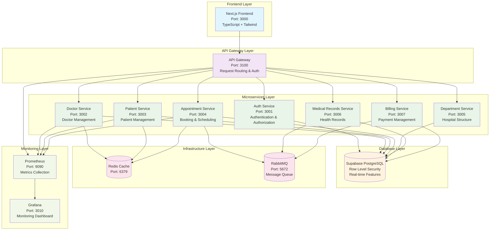

# 🏗️ System Architecture Diagram

## Mô tả
Diagram tổng quan kiến trúc microservices của hệ thống quản lý bệnh viện, bao gồm tất cả các layer và thành phần chính.

## Diagram

## Thành phần chính

### **Frontend Layer**
- **Next.js Frontend**: Giao diện người dùng với TypeScript và Tailwind CSS
- **Port**: 3000

### **API Gateway Layer**
- **API Gateway**: Điều hướng request và xác thực
- **Port**: 3100

### **Microservices Layer**
- **Auth Service** (3001): Xác thực và phân quyền
- **Doctor Service** (3002): Quản lý bác sĩ
- **Patient Service** (3003): Quản lý bệnh nhân
- **Appointment Service** (3004): Đặt lịch và lên lịch
- **Department Service** (3005): Cấu trúc bệnh viện
- **Medical Records Service** (3006): Hồ sơ sức khỏe
- **Billing Service** (3007): Quản lý thanh toán

### **Database Layer**
- **Supabase PostgreSQL**: Database chính với Row Level Security

### **Infrastructure Layer**
- **Redis Cache** (6379): Bộ nhớ đệm
- **RabbitMQ** (5672): Message queue

### **Monitoring Layer**
- **Prometheus** (9090): Thu thập metrics
- **Grafana** (3010): Dashboard giám sát

## Luồng dữ liệu
1. Frontend gửi request đến API Gateway
2. API Gateway xác thực và điều hướng đến service phù hợp
3. Service xử lý business logic và truy cập database
4. Kết quả được trả về qua API Gateway đến Frontend
5. Monitoring system theo dõi toàn bộ quá trình
