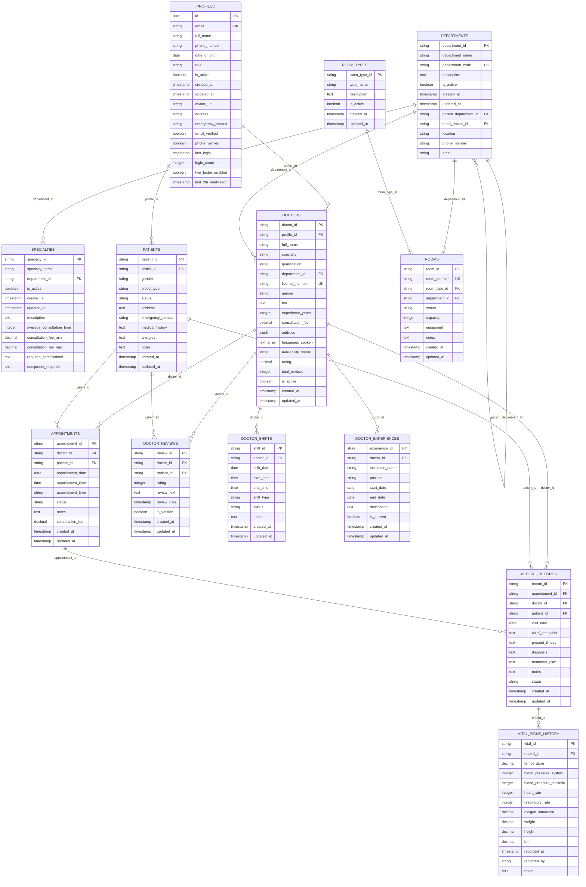

# 🗄️ Database Entity Relationship Diagram

## Mô tả
Entity Relationship Diagram chi tiết cấu trúc database của hệ thống quản lý bệnh viện, hiển thị tất cả bảng và mối quan hệ.

## Diagram

## Mối quan hệ chính

### **Core Entities**
- **PROFILES**: Bảng người dùng trung tâm
- **DEPARTMENTS**: Các khoa trong bệnh viện
- **SPECIALTIES**: Chuyên khoa thuộc các khoa

### **User Entities**
- **DOCTORS**: Thông tin bác sĩ
- **PATIENTS**: Thông tin bệnh nhân

### **Business Entities**
- **APPOINTMENTS**: Lịch hẹn khám
- **MEDICAL_RECORDS**: Hồ sơ bệnh án
- **VITAL_SIGNS_HISTORY**: Lịch sử sinh hiệu

### **Supporting Entities**
- **DOCTOR_REVIEWS**: Đánh giá bác sĩ
- **DOCTOR_SHIFTS**: Ca trực bác sĩ
- **DOCTOR_EXPERIENCES**: Kinh nghiệm bác sĩ
- **ROOMS**: Phòng khám
- **ROOM_TYPES**: Loại phòng

## Key Features
- **Row Level Security**: Bảo mật cấp dòng
- **Department-based IDs**: ID theo khoa
- **Audit Trail**: Theo dõi thay đổi
- **Real-time Updates**: Cập nhật thời gian thực
