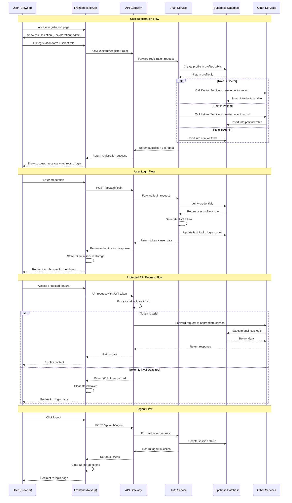

# 🔐 Authentication Flow Diagram

## Mô tả
Sequence diagram mô tả luồng xác thực người dùng từ đăng ký, đăng nhập đến truy cập các tính năng được bảo vệ.

## Diagram

## Luồng hoạt động chính

### **1. User Registration Flow**
1. Người dùng truy cập trang đăng ký
2. Chọn vai trò (Doctor/Patient/Admin)
3. Điền form đăng ký
4. Hệ thống tạo profile trong bảng profiles
5. Tạo record tương ứng trong bảng role-specific
6. Trả về thông báo thành công

### **2. User Login Flow**
1. Người dùng nhập thông tin đăng nhập
2. Hệ thống xác thực credentials
3. Tạo JWT token
4. Cập nhật thông tin đăng nhập
5. Chuyển hướng đến dashboard theo role

### **3. Protected API Request Flow**
1. Người dùng truy cập tính năng được bảo vệ
2. Frontend gửi request kèm JWT token
3. API Gateway validate token
4. Nếu hợp lệ: chuyển tiếp đến service
5. Nếu không hợp lệ: trả về 401 và redirect login

### **4. Logout Flow**
1. Người dùng click logout
2. Hệ thống cập nhật session status
3. Clear tất cả stored tokens
4. Chuyển hướng về trang login

## Security Features

### **JWT Token Management**
- Secure token generation
- Token expiration handling
- Automatic token refresh

### **Role-based Access Control**
- Different dashboards per role
- Role-specific API endpoints
- Permission validation

### **Session Management**
- Login count tracking
- Last login timestamp
- Session invalidation on logout

### **Security Measures**
- Secure token storage
- HTTPS enforcement
- Input validation
- SQL injection prevention
