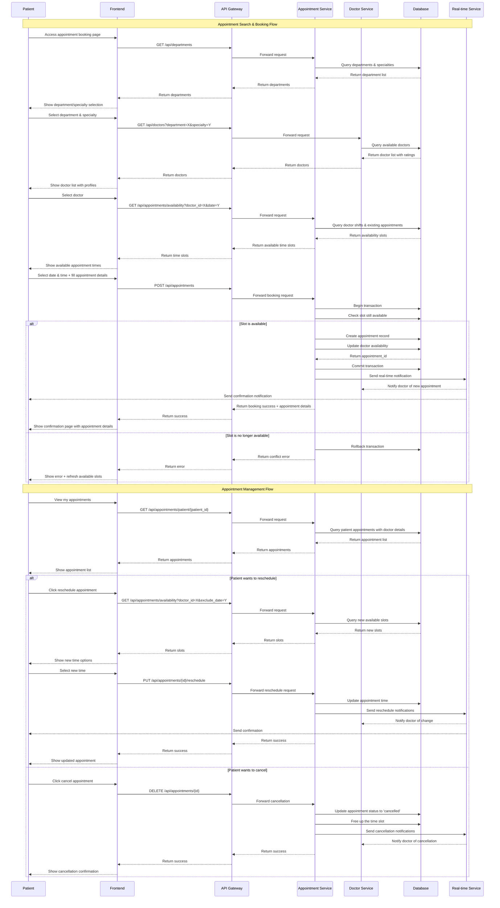

# 📅 Appointment Booking Flow Diagram

## Mô tả
Sequence diagram mô tả quy trình đặt lịch hẹn từ tìm kiếm bác sĩ đến xác nhận lịch hẹn và quản lý lịch hẹn.

## Diagram

## Quy trình chính

### **1. Appointment Search Flow**
1. **Department Selection**: Bệnh nhân chọn khoa và chuyên khoa
2. **Doctor Selection**: Hiển thị danh sách bác sĩ với rating và thông tin
3. **Time Selection**: Hiển thị các slot thời gian có sẵn
4. **Booking Confirmation**: Xác nhận thông tin và tạo lịch hẹn

### **2. Appointment Booking Process**
1. **Availability Check**: Kiểm tra slot còn trống
2. **Transaction Management**: Sử dụng database transaction
3. **Real-time Notification**: Thông báo cho bác sĩ và bệnh nhân
4. **Conflict Handling**: Xử lý trường hợp slot đã được đặt

### **3. Appointment Management**
1. **View Appointments**: Xem danh sách lịch hẹn
2. **Reschedule**: Thay đổi thời gian lịch hẹn
3. **Cancel**: Hủy lịch hẹn và giải phóng slot

## Key Features

### **Real-time Updates**
- Thông báo tức thời cho bác sĩ và bệnh nhân
- Cập nhật availability real-time
- WebSocket connections

### **Conflict Prevention**
- Database transactions
- Optimistic locking
- Slot availability validation

### **User Experience**
- Intuitive booking interface
- Clear appointment status
- Easy reschedule/cancel options

### **Business Logic**
- Doctor availability management
- Appointment type handling
- Consultation fee calculation

## Status Management

### **Appointment Statuses**
- `scheduled`: Đã đặt lịch
- `confirmed`: Đã xác nhận
- `in-progress`: Đang khám
- `completed`: Hoàn thành
- `cancelled`: Đã hủy
- `no-show`: Không đến khám

### **Notification Types**
- Booking confirmation
- Reschedule notification
- Cancellation notice
- Reminder notifications
