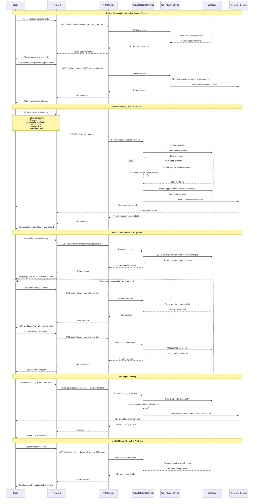

# 📋 Medical Records Management Flow

## Mô tả
Sequence diagram mô tả quy trình tạo và quản lý hồ sơ bệnh án từ khám bệnh đến lưu trữ và truy xuất thông tin.

## Diagram

## Quy trình chính

### **1. Patient Consultation Process**
1. **Appointment Access**: Bác sĩ xem lịch hẹn hôm nay
2. **Start Consultation**: Bắt đầu khám bệnh
3. **Record Creation**: Tạo hồ sơ bệnh án mới
4. **Status Update**: Cập nhật trạng thái lịch hẹn

### **2. Medical Record Creation**
1. **Patient Examination**: Điền form khám bệnh
   - Chief complaint (Lý do khám)
   - Present illness (Bệnh sử hiện tại)
   - Physical examination (Khám lâm sàng)
   - Vital signs (Sinh hiệu)
   - Diagnosis (Chẩn đoán)
   - Treatment plan (Kế hoạch điều trị)

2. **Data Processing**: Xử lý và lưu trữ dữ liệu
3. **Vital Signs**: Tính toán BMI và các chỉ số sức khỏe
4. **Notification**: Thông báo hoàn thành

### **3. Medical History Management**
1. **History Access**: Xem lịch sử bệnh án
2. **Record Updates**: Cập nhật thông tin
3. **Audit Trail**: Theo dõi thay đổi
4. **Search & Analytics**: Tìm kiếm và phân tích

## Key Features

### **Comprehensive Record Management**
- Complete patient examination forms
- Vital signs tracking with calculations
- Medical history timeline
- Treatment plan documentation

### **Real-time Features**
- Live status updates during consultation
- Health alerts for abnormal vital signs
- Instant record confirmation
- Real-time collaboration

### **Data Integrity**
- Transaction-based record creation
- Audit trail for all changes
- Data validation and verification
- Backup and recovery

### **Clinical Decision Support**
- BMI calculation
- Health indicator analysis
- Abnormal value alerts
- Historical trend analysis

## Medical Record Components

### **Core Information**
- Patient demographics
- Chief complaint
- Present illness history
- Physical examination findings

### **Vital Signs Tracking**
- Temperature
- Blood pressure (systolic/diastolic)
- Heart rate
- Respiratory rate
- Oxygen saturation
- Weight and height
- BMI calculation

### **Clinical Data**
- Diagnosis
- Treatment plan
- Medications prescribed
- Follow-up instructions
- Notes and observations

### **Metadata**
- Record creation timestamp
- Last update information
- Doctor who created/updated
- Appointment reference
- Status tracking
