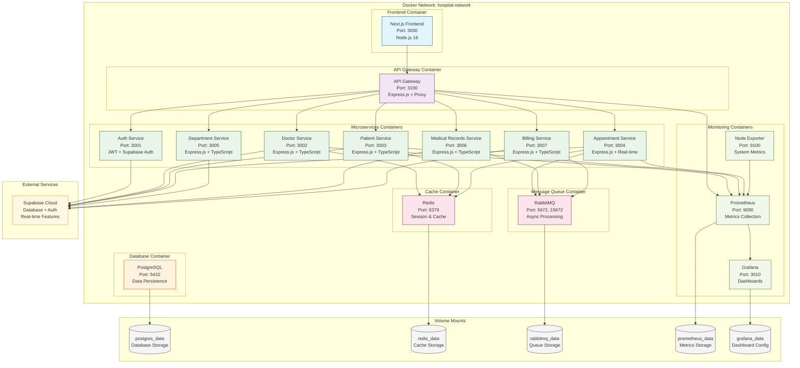

# 🐳 Docker Container Architecture

## Mô tả
Diagram kiến trúc container hóa của hệ thống quản lý bệnh viện sử dụng Docker và Docker Compose.

## Diagram



## Container Architecture

### **Frontend Layer**
- **Next.js Frontend**: React-based user interface
- **Technology**: Node.js 18, TypeScript, Tailwind CSS
- **Port**: 3000

### **API Gateway Layer**
- **API Gateway**: Request routing and authentication
- **Technology**: Express.js with http-proxy-middleware
- **Port**: 3100

### **Microservices Layer**
- **Auth Service** (3001): JWT authentication + Supabase Auth
- **Doctor Service** (3002): Doctor management with real-time features
- **Patient Service** (3003): Patient management and health tracking
- **Appointment Service** (3004): Booking system with WebSocket
- **Department Service** (3005): Hospital structure management
- **Medical Records Service** (3006): Health records and vital signs
- **Billing Service** (3007): Payment and billing management

### **Infrastructure Layer**
- **PostgreSQL** (5432): Primary database for local development
- **Redis** (6379): Caching and session storage
- **RabbitMQ** (5672, 15672): Message queue for async processing

### **Monitoring Layer**
- **Prometheus** (9090): Metrics collection and storage
- **Grafana** (3010): Monitoring dashboards and visualization
- **Node Exporter** (9100): System metrics collection

## Docker Compose Profiles

### **Core Profile** (Essential Services)
```bash
docker-compose --profile core up
```
- Frontend
- API Gateway
- Auth Service
- Doctor Service
- Patient Service
- Appointment Service
- Redis
- PostgreSQL

### **Full Profile** (All Services)
```bash
docker-compose --profile full up
```
- All Core services
- Department Service
- Medical Records Service
- Billing Service
- RabbitMQ
- Monitoring stack

### **Monitoring Profile** (Monitoring Only)
```bash
docker-compose --profile monitoring up
```
- Prometheus
- Grafana
- Node Exporter

## Volume Management

### **Persistent Storage**
- **postgres_data**: Database files
- **redis_data**: Cache persistence
- **rabbitmq_data**: Message queue storage
- **prometheus_data**: Metrics storage
- **grafana_data**: Dashboard configurations

### **Development Volumes**
- Source code bind mounts for hot reload
- Node modules caching
- Build artifacts

## Network Configuration

### **Internal Network**
- **Name**: hospital-network
- **Driver**: bridge
- **Isolation**: Container-to-container communication

### **Port Mapping**
- Frontend: 3000 → 3000
- API Gateway: 3100 → 3100
- Services: 3001-3007 → 3001-3007
- Database: 5432 → 5432
- Redis: 6379 → 6379
- RabbitMQ: 5672, 15672 → 5672, 15672
- Monitoring: 9090, 3010, 9100 → 9090, 3010, 9100

## Environment Configuration

### **Development Environment**
- Hot reload enabled
- Debug logging
- Development database
- Local file storage

### **Production Environment**
- Optimized builds
- Production logging
- External database (Supabase)
- Cloud storage integration

## Health Checks

### **Service Health Endpoints**
- All services expose `/health` endpoints
- Docker health checks configured
- Automatic restart on failure
- Dependency health validation

### **Monitoring Integration**
- Prometheus metrics collection
- Grafana dashboard visualization
- Alert configuration
- Performance monitoring
