# 👥 Use Case Diagram

## Mô tả
Use Case Diagram mô tả các chức năng chính của hệ thống quản lý bệnh viện và tương tác giữa các actor với hệ thống.

## Diagram

```mermaid
graph TB
    subgraph "Hospital Management System"
        subgraph "Authentication Module"
            UC1[Register Account]
            UC2[Login/Logout]
            UC3[Reset Password]
            UC4[Change Password]
            UC5[Enable 2FA]
        end
        
        subgraph "Patient Management"
            UC6[View Patient Profile]
            UC7[Update Patient Info]
            UC8[View Medical History]
            UC9[Book Appointment]
            UC10[Reschedule Appointment]
            UC11[Cancel Appointment]
            UC12[View Appointments]
            UC13[Rate Doctor]
            UC14[View Prescriptions]
        end
        
        subgraph "Doctor Management"
            UC15[View Doctor Profile]
            UC16[Update Doctor Info]
            UC17[Manage Schedule]
            UC18[View Today's Appointments]
            UC19[Start Consultation]
            UC20[Create Medical Record]
            UC21[Update Medical Record]
            UC22[Record Vital Signs]
            UC23[Prescribe Medication]
            UC24[View Patient History]
            UC25[Manage Shifts]
            UC26[View Reviews]
        end
        
        subgraph "Admin Management"
            UC27[Manage Users]
            UC28[Manage Departments]
            UC29[Manage Specialties]
            UC30[Manage Rooms]
            UC31[View System Reports]
            UC32[Monitor System Health]
            UC33[Manage Billing]
            UC34[Export Data]
        end
        
        subgraph "Appointment System"
            UC35[Search Doctors]
            UC36[Check Availability]
            UC37[Confirm Appointment]
            UC38[Send Notifications]
            UC39[Generate Reports]
        end
        
        subgraph "Medical Records System"
            UC40[Create Record]
            UC41[Update Record]
            UC42[Search Records]
            UC43[Generate Medical Reports]
            UC44[Track Vital Signs]
            UC45[Manage Prescriptions]
        end
    end
    
    %% Actors
    PATIENT[👤 Patient<br/>Bệnh nhân]
    DOCTOR[👨‍⚕️ Doctor<br/>Bác sĩ]
    ADMIN[👨‍💼 Admin<br/>Quản trị viên]
    SYSTEM[🤖 System<br/>Hệ thống]
    
    %% Patient Use Cases
    PATIENT --> UC1
    PATIENT --> UC2
    PATIENT --> UC3
    PATIENT --> UC4
    PATIENT --> UC5
    PATIENT --> UC6
    PATIENT --> UC7
    PATIENT --> UC8
    PATIENT --> UC9
    PATIENT --> UC10
    PATIENT --> UC11
    PATIENT --> UC12
    PATIENT --> UC13
    PATIENT --> UC14
    PATIENT --> UC35
    
    %% Doctor Use Cases
    DOCTOR --> UC1
    DOCTOR --> UC2
    DOCTOR --> UC3
    DOCTOR --> UC4
    DOCTOR --> UC5
    DOCTOR --> UC15
    DOCTOR --> UC16
    DOCTOR --> UC17
    DOCTOR --> UC18
    DOCTOR --> UC19
    DOCTOR --> UC20
    DOCTOR --> UC21
    DOCTOR --> UC22
    DOCTOR --> UC23
    DOCTOR --> UC24
    DOCTOR --> UC25
    DOCTOR --> UC26
    DOCTOR --> UC40
    DOCTOR --> UC41
    DOCTOR --> UC42
    DOCTOR --> UC43
    DOCTOR --> UC44
    DOCTOR --> UC45
    
    %% Admin Use Cases
    ADMIN --> UC1
    ADMIN --> UC2
    ADMIN --> UC3
    ADMIN --> UC4
    ADMIN --> UC5
    ADMIN --> UC27
    ADMIN --> UC28
    ADMIN --> UC29
    ADMIN --> UC30
    ADMIN --> UC31
    ADMIN --> UC32
    ADMIN --> UC33
    ADMIN --> UC34
    ADMIN --> UC39
    ADMIN --> UC43
    
    %% System Use Cases
    SYSTEM --> UC36
    SYSTEM --> UC37
    SYSTEM --> UC38
    SYSTEM --> UC39
    SYSTEM --> UC32
    
    %% Styling
    classDef actor fill:#e3f2fd,stroke:#1976d2,stroke-width:2px
    classDef usecase fill:#f3e5f5,stroke:#7b1fa2
    classDef system fill:#e8f5e8,stroke:#388e3c
    
    class PATIENT,DOCTOR,ADMIN actor
    class SYSTEM system
    class UC1,UC2,UC3,UC4,UC5,UC6,UC7,UC8,UC9,UC10,UC11,UC12,UC13,UC14,UC15,UC16,UC17,UC18,UC19,UC20,UC21,UC22,UC23,UC24,UC25,UC26,UC27,UC28,UC29,UC30,UC31,UC32,UC33,UC34,UC35,UC36,UC37,UC38,UC39,UC40,UC41,UC42,UC43,UC44,UC45 usecase
```

## Actors và Vai trò

### **👤 Patient (Bệnh nhân)**
- Đăng ký tài khoản và quản lý thông tin cá nhân
- Đặt lịch hẹn và quản lý lịch khám
- Xem lịch sử khám bệnh và đơn thuốc
- Đánh giá bác sĩ sau khi khám

### **👨‍⚕️ Doctor (Bác sĩ)**
- Quản lý thông tin cá nhân và lịch trực
- Xem lịch hẹn và thực hiện khám bệnh
- Tạo và cập nhật hồ sơ bệnh án
- Kê đơn thuốc và theo dõi bệnh nhân

### **👨‍💼 Admin (Quản trị viên)**
- Quản lý người dùng và phân quyền
- Quản lý cấu trúc bệnh viện (khoa, phòng)
- Theo dõi hoạt động hệ thống
- Tạo báo cáo và xuất dữ liệu

### **🤖 System (Hệ thống)**
- Tự động kiểm tra lịch trống
- Gửi thông báo và nhắc nhở
- Tạo báo cáo tự động
- Giám sát sức khỏe hệ thống

## Use Cases chi tiết

### **Authentication Module**
- **UC1**: Register Account - Đăng ký tài khoản mới
- **UC2**: Login/Logout - Đăng nhập/đăng xuất
- **UC3**: Reset Password - Đặt lại mật khẩu
- **UC4**: Change Password - Thay đổi mật khẩu
- **UC5**: Enable 2FA - Kích hoạt xác thực 2 yếu tố

### **Patient Management**
- **UC6-UC8**: Quản lý thông tin và lịch sử bệnh án
- **UC9-UC12**: Quản lý lịch hẹn (đặt, sửa, hủy, xem)
- **UC13**: Rate Doctor - Đánh giá bác sĩ
- **UC14**: View Prescriptions - Xem đơn thuốc

### **Doctor Management**
- **UC15-UC17**: Quản lý thông tin và lịch trực
- **UC18-UC26**: Khám bệnh và quản lý bệnh nhân
- **UC40-UC45**: Quản lý hồ sơ bệnh án

### **Admin Management**
- **UC27-UC30**: Quản lý người dùng và cấu trúc
- **UC31-UC34**: Báo cáo và giám sát hệ thống

## Mối quan hệ Use Case

### **Include Relationships**
- Login ← Register Account
- Create Medical Record ← Start Consultation
- Send Notifications ← Confirm Appointment

### **Extend Relationships**
- Enable 2FA → Login
- Record Vital Signs → Create Medical Record
- Generate Reports → View System Reports

### **Generalization**
- Manage Profile ← Update Patient Info, Update Doctor Info
- View Records ← View Medical History, View Patient History
