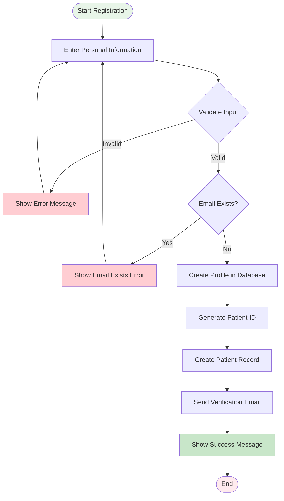
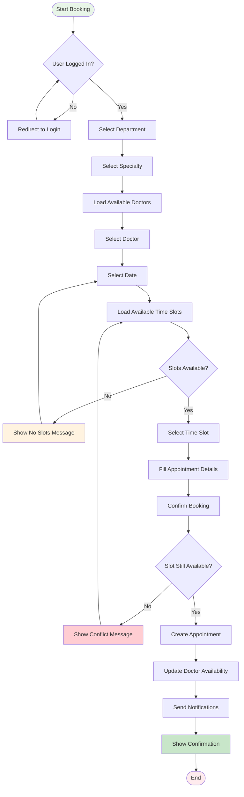
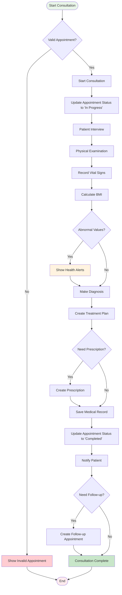
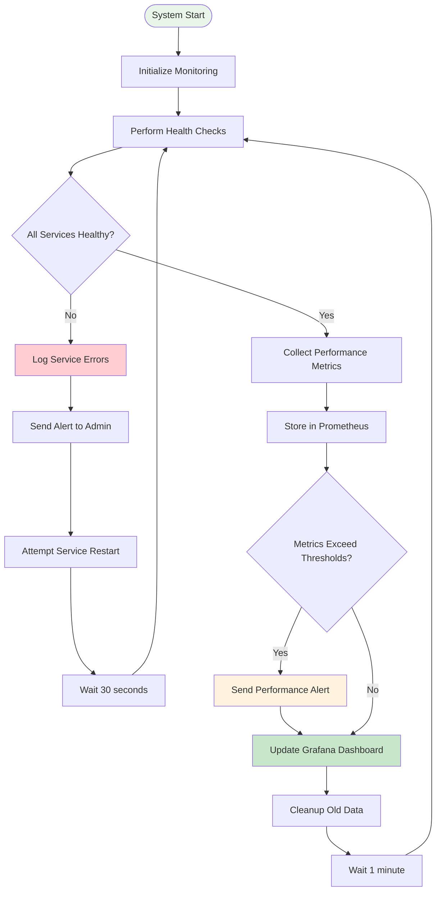
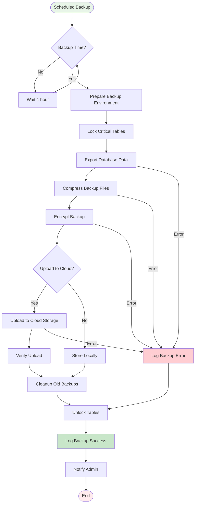

# 🔄 Activity Diagram

## Mô tả
Activity Diagram mô tả luồng hoạt động chi tiết của các quy trình nghiệp vụ chính trong hệ thống quản lý bệnh viện.

## 1. Patient Registration Activity

## 2. Appointment Booking Activity

## 3. Medical Consultation Activity

## 4. System Monitoring Activity

## 5. Data Backup Activity

## Đặc điểm Activity Diagrams

### **Parallel Activities**
- Health checks và metric collection chạy song song
- Backup và monitoring hoạt động độc lập
- Multiple user sessions được xử lý đồng thời

### **Decision Points**
- Validation checks tại mọi input
- Conditional flows dựa trên business rules
- Error handling và recovery paths

### **Synchronization**
- Database transactions đảm bảo consistency
- Lock mechanisms cho critical operations
- Event-driven notifications

### **Exception Handling**
- Graceful error recovery
- User-friendly error messages
- System resilience và fault tolerance

## Business Rules

### **Appointment Booking**
- Chỉ cho phép đặt lịch trong giờ làm việc
- Không được đặt trùng slot đã có
- Tự động hủy lịch không confirm trong 24h

### **Medical Records**
- Bắt buộc có chẩn đoán trước khi hoàn thành
- Vital signs phải trong khoảng hợp lệ
- Audit trail cho mọi thay đổi

### **System Operations**
- Backup hàng ngày vào 2:00 AM
- Health check mỗi phút
- Alert ngay khi có lỗi critical
