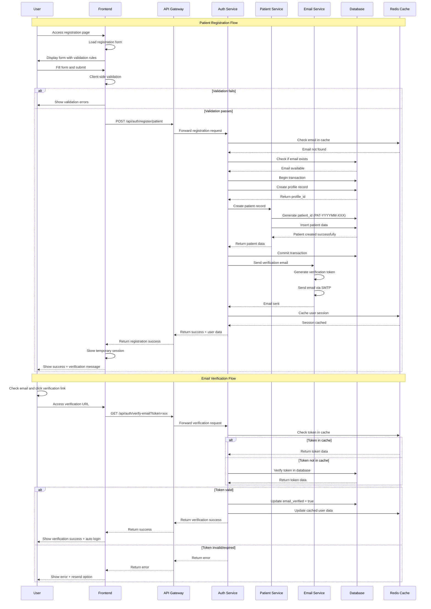
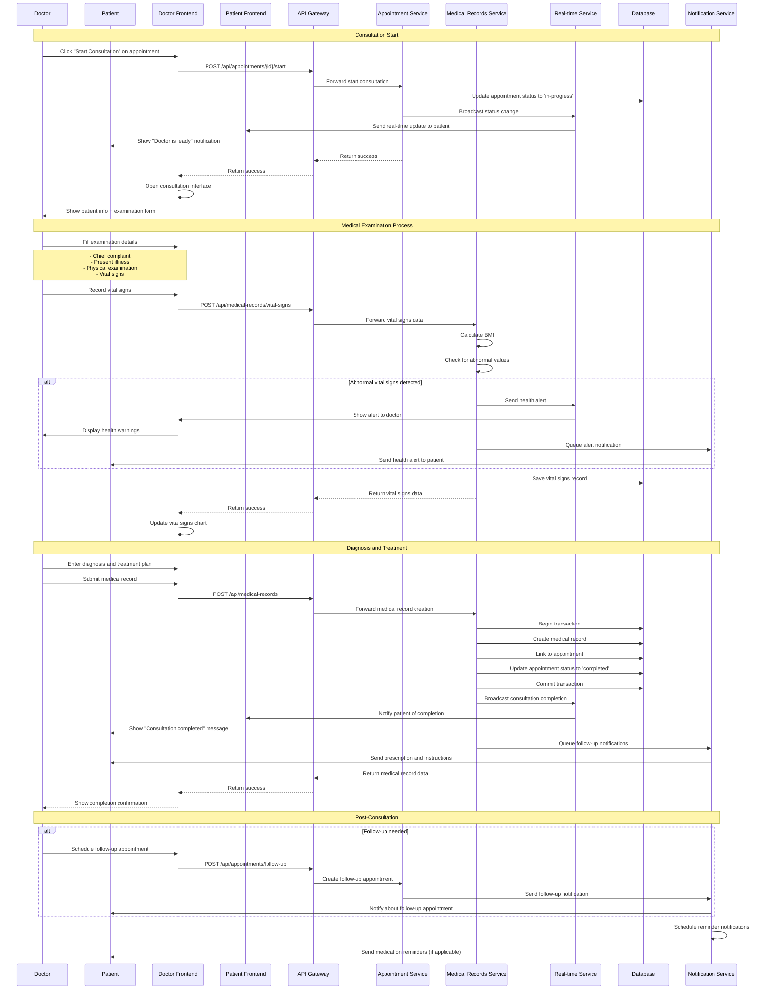
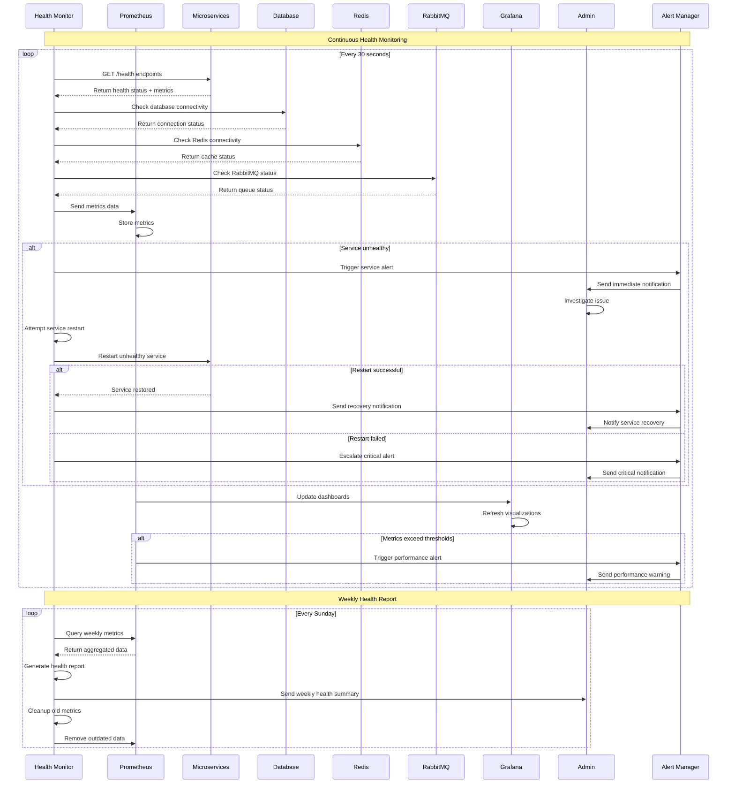

# 🔄 Detailed Sequence Diagrams

## Mô tả
Các sequence diagram chi tiết cho các use case phức tạp trong hệ thống quản lý bệnh viện.

## 1. Complete Patient Registration Sequence



## 2. Doctor Consultation with Real-time Updates



## 3. System Health Monitoring Sequence



## 4. Data Synchronization Sequence

```mermaid
sequenceDiagram
    participant APP as Application
    participant LOCAL_DB as Local Database
    participant SUPABASE as Supabase Cloud
    participant SYNC as Sync Service
    participant CACHE as Redis Cache
    participant BACKUP as Backup Service

    Note over APP,BACKUP: Real-time Data Sync
    
    APP->>LOCAL_DB: Write operation
    LOCAL_DB->>LOCAL_DB: Store data locally
    LOCAL_DB->>SYNC: Trigger sync event
    
    SYNC->>SUPABASE: Replicate to cloud
    
    alt Sync successful
        SUPABASE-->>SYNC: Confirm sync
        SYNC->>CACHE: Update cache
        SYNC->>LOCAL_DB: Mark as synced
    else Sync failed
        SYNC->>SYNC: Queue for retry
        SYNC->>SYNC: Log sync error
        
        loop Retry mechanism
            SYNC->>SUPABASE: Retry sync
            alt Retry successful
                SUPABASE-->>SYNC: Confirm sync
                SYNC->>CACHE: Update cache
                break
            else Retry failed
                SYNC->>SYNC: Exponential backoff
            end
        end
    end

    Note over APP,BACKUP: Conflict Resolution
    
    alt Concurrent updates detected
        SYNC->>SYNC: Detect conflict
        SYNC->>SUPABASE: Get latest version
        SUPABASE-->>SYNC: Return cloud version
        
        SYNC->>SYNC: Apply conflict resolution rules
        alt Local version newer
            SYNC->>SUPABASE: Update cloud with local
        else Cloud version newer
            SYNC->>LOCAL_DB: Update local with cloud
        else Manual resolution needed
            SYNC->>APP: Request user resolution
            APP->>APP: Show conflict resolution UI
        end
    end

    Note over APP,BACKUP: Backup Integration
    
    loop Every 6 hours
        BACKUP->>LOCAL_DB: Create incremental backup
        BACKUP->>BACKUP: Compress backup data
        BACKUP->>SUPABASE: Store backup in cloud
        BACKUP->>CACHE: Update backup status
    end
```

## Key Sequence Features

### **Error Handling**
- Comprehensive error scenarios
- Graceful degradation
- Automatic retry mechanisms
- User-friendly error messages

### **Real-time Communication**
- WebSocket connections
- Event-driven updates
- Live status synchronization
- Instant notifications

### **Performance Optimization**
- Caching strategies
- Database optimization
- Async processing
- Load balancing

### **Security Measures**
- Token validation
- Session management
- Data encryption
- Audit logging
