# 🚀 Deployment Diagram

## Mô tả
Deployment Diagram mô tả kiến trúc triển khai hệ thống quản lý bệnh viện trên các môi trường khác nhau.

## Production Deployment Architecture

```mermaid
graph TB
    subgraph "Internet"
        USERS[👥 Users<br/>Doctors, Patients, Admins]
        MOBILE[📱 Mobile Apps<br/>iOS/Android]
    end
    
    subgraph "CDN Layer"
        CDN[🌐 CloudFlare CDN<br/>Static Assets<br/>Global Distribution]
    end
    
    subgraph "Load Balancer Layer"
        LB[⚖️ Load Balancer<br/>NGINX/HAProxy<br/>SSL Termination]
    end
    
    subgraph "Production Environment - AWS/Azure"
        subgraph "Frontend Cluster"
            FE1[🖥️ Frontend Instance 1<br/>Next.js<br/>Node.js 18<br/>4GB RAM, 2 vCPU]
            FE2[🖥️ Frontend Instance 2<br/>Next.js<br/>Node.js 18<br/>4GB RAM, 2 vCPU]
        end
        
        subgraph "API Gateway Cluster"
            GW1[🚪 API Gateway 1<br/>Express.js<br/>8GB RAM, 4 vCPU]
            GW2[🚪 API Gateway 2<br/>Express.js<br/>8GB RAM, 4 vCPU]
        end
        
        subgraph "Microservices Cluster"
            subgraph "Auth Service Cluster"
                AUTH1[🔐 Auth Service 1<br/>Node.js<br/>4GB RAM, 2 vCPU]
                AUTH2[🔐 Auth Service 2<br/>Node.js<br/>4GB RAM, 2 vCPU]
            end
            
            subgraph "Doctor Service Cluster"
                DOC1[👨‍⚕️ Doctor Service 1<br/>Node.js<br/>4GB RAM, 2 vCPU]
                DOC2[👨‍⚕️ Doctor Service 2<br/>Node.js<br/>4GB RAM, 2 vCPU]
            end
            
            subgraph "Patient Service Cluster"
                PAT1[🏥 Patient Service 1<br/>Node.js<br/>4GB RAM, 2 vCPU]
                PAT2[🏥 Patient Service 2<br/>Node.js<br/>4GB RAM, 2 vCPU]
            end
            
            subgraph "Appointment Service Cluster"
                APP1[📅 Appointment Service 1<br/>Node.js + WebSocket<br/>6GB RAM, 3 vCPU]
                APP2[📅 Appointment Service 2<br/>Node.js + WebSocket<br/>6GB RAM, 3 vCPU]
            end
        end
        
        subgraph "Database Layer"
            SUPABASE[🗄️ Supabase Cloud<br/>PostgreSQL<br/>Managed Database<br/>Auto-scaling]
            
            REDIS_CLUSTER[🔴 Redis Cluster<br/>3 Master + 3 Replica<br/>High Availability<br/>16GB RAM each]
        end
        
        subgraph "Message Queue"
            RABBIT_CLUSTER[🐰 RabbitMQ Cluster<br/>3 Nodes<br/>High Availability<br/>8GB RAM each]
        end
        
        subgraph "Monitoring Stack"
            PROM[📊 Prometheus<br/>Metrics Collection<br/>16GB RAM, 4 vCPU]
            GRAF[📈 Grafana<br/>Dashboards<br/>8GB RAM, 2 vCPU]
            ALERT[🚨 AlertManager<br/>Notification Hub<br/>4GB RAM, 1 vCPU]
        end
        
        subgraph "Logging Stack"
            ELK1[📝 Elasticsearch<br/>Log Storage<br/>32GB RAM, 8 vCPU]
            ELK2[📝 Logstash<br/>Log Processing<br/>16GB RAM, 4 vCPU]
            ELK3[📝 Kibana<br/>Log Visualization<br/>8GB RAM, 2 vCPU]
        end
    end
    
    subgraph "External Services"
        EMAIL[📧 Email Service<br/>SendGrid/AWS SES]
        SMS[📱 SMS Service<br/>Twilio]
        STORAGE[💾 File Storage<br/>AWS S3/Azure Blob]
        BACKUP[💿 Backup Service<br/>Automated Backups]
    end
    
    %% User Connections
    USERS --> CDN
    MOBILE --> CDN
    CDN --> LB
    
    %% Load Balancer Distribution
    LB --> FE1
    LB --> FE2
    LB --> GW1
    LB --> GW2
    
    %% Frontend to Gateway
    FE1 --> GW1
    FE1 --> GW2
    FE2 --> GW1
    FE2 --> GW2
    
    %% Gateway to Services
    GW1 --> AUTH1
    GW1 --> AUTH2
    GW1 --> DOC1
    GW1 --> PAT1
    GW1 --> APP1
    
    GW2 --> AUTH2
    GW2 --> DOC2
    GW2 --> PAT2
    GW2 --> APP2
    
    %% Services to Database
    AUTH1 --> SUPABASE
    AUTH2 --> SUPABASE
    DOC1 --> SUPABASE
    DOC2 --> SUPABASE
    PAT1 --> SUPABASE
    PAT2 --> SUPABASE
    APP1 --> SUPABASE
    APP2 --> SUPABASE
    
    %% Services to Cache
    DOC1 --> REDIS_CLUSTER
    DOC2 --> REDIS_CLUSTER
    PAT1 --> REDIS_CLUSTER
    PAT2 --> REDIS_CLUSTER
    APP1 --> REDIS_CLUSTER
    APP2 --> REDIS_CLUSTER
    
    %% Services to Message Queue
    APP1 --> RABBIT_CLUSTER
    APP2 --> RABBIT_CLUSTER
    
    %% Monitoring Connections
    GW1 --> PROM
    GW2 --> PROM
    AUTH1 --> PROM
    AUTH2 --> PROM
    DOC1 --> PROM
    DOC2 --> PROM
    PAT1 --> PROM
    PAT2 --> PROM
    APP1 --> PROM
    APP2 --> PROM
    
    PROM --> GRAF
    PROM --> ALERT
    
    %% Logging Connections
    GW1 --> ELK2
    GW2 --> ELK2
    AUTH1 --> ELK2
    AUTH2 --> ELK2
    DOC1 --> ELK2
    DOC2 --> ELK2
    PAT1 --> ELK2
    PAT2 --> ELK2
    APP1 --> ELK2
    APP2 --> ELK2
    
    ELK2 --> ELK1
    ELK1 --> ELK3
    
    %% External Service Connections
    AUTH1 --> EMAIL
    AUTH2 --> EMAIL
    APP1 --> SMS
    APP2 --> SMS
    SUPABASE --> STORAGE
    SUPABASE --> BACKUP
    
    %% Styling
    classDef user fill:#e3f2fd,stroke:#1976d2
    classDef frontend fill:#e8f5e8,stroke:#388e3c
    classDef gateway fill:#f3e5f5,stroke:#7b1fa2
    classDef service fill:#fff3e0,stroke:#f57c00
    classDef database fill:#ffebee,stroke:#d32f2f
    classDef infrastructure fill:#fce4ec,stroke:#880e4f
    classDef monitoring fill:#f1f8e9,stroke:#33691e
    classDef external fill:#fff8e1,stroke:#ff8f00
    
    class USERS,MOBILE user
    class CDN,LB,FE1,FE2 frontend
    class GW1,GW2 gateway
    class AUTH1,AUTH2,DOC1,DOC2,PAT1,PAT2,APP1,APP2 service
    class SUPABASE,REDIS_CLUSTER,RABBIT_CLUSTER database
    class PROM,GRAF,ALERT,ELK1,ELK2,ELK3 monitoring
    class EMAIL,SMS,STORAGE,BACKUP external
```

## Development Environment

## Deployment Specifications

### **Production Environment**

#### **Infrastructure Requirements**
- **Cloud Provider**: AWS/Azure/GCP
- **Kubernetes Cluster**: 3 master + 6 worker nodes
- **Total Resources**: 128GB RAM, 64 vCPU
- **Storage**: 2TB SSD for databases, 5TB for backups

#### **High Availability Setup**
- **Load Balancer**: 2 instances with failover
- **Frontend**: 2 instances behind load balancer
- **API Gateway**: 2 instances with session affinity
- **Microservices**: 2 instances each with auto-scaling
- **Database**: Supabase with read replicas
- **Cache**: Redis cluster with 3 masters + 3 replicas

#### **Security Configuration**
- **SSL/TLS**: End-to-end encryption
- **VPC**: Private network with security groups
- **Firewall**: WAF protection
- **Secrets**: Managed secret storage
- **Monitoring**: 24/7 security monitoring

### **Development Environment**

#### **Local Setup**
- **Docker Desktop**: 8GB RAM minimum
- **Node.js**: Version 18+
- **Database**: Local PostgreSQL + Supabase dev project
- **Hot Reload**: Enabled for all services

#### **Development Tools**
- **Code Editor**: VS Code with extensions
- **API Testing**: Postman/Insomnia
- **Database**: pgAdmin/Supabase Studio
- **Monitoring**: Local Prometheus + Grafana

### **Staging Environment**

#### **Pre-production Testing**
- **Scaled-down production**: 50% of production resources
- **Real data simulation**: Anonymized production data
- **Performance testing**: Load testing with realistic scenarios
- **Security testing**: Penetration testing and vulnerability scans

## Deployment Process

### **CI/CD Pipeline**
1. **Code Commit**: Developer pushes to Git
2. **Build**: Docker images built and tested
3. **Test**: Automated testing suite
4. **Security Scan**: Container vulnerability scanning
5. **Deploy to Staging**: Automatic deployment
6. **Integration Tests**: End-to-end testing
7. **Manual Approval**: QA sign-off
8. **Deploy to Production**: Blue-green deployment
9. **Health Check**: Post-deployment verification
10. **Rollback**: Automatic rollback if issues detected

### **Monitoring and Alerting**
- **Uptime Monitoring**: 99.9% availability target
- **Performance Metrics**: Response time < 200ms
- **Error Tracking**: Real-time error monitoring
- **Log Aggregation**: Centralized logging with ELK stack
- **Alert Channels**: Email, SMS, Slack integration
