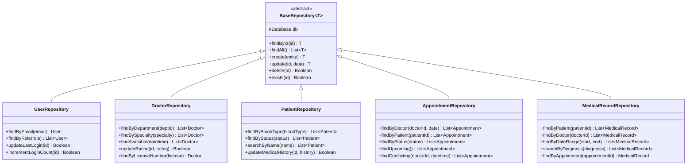

# 🏗️ Class Diagram

## Mô tả
Class Diagram mô tả cấu trúc các lớp chính trong hệ thống quản lý bệnh viện và mối quan hệ giữa chúng.

## Core Domain Classes

```mermaid
classDiagram
    class User {
        +String id
        +String email
        +String password_hash
        +String role
        +Boolean is_active
        +DateTime created_at
        +DateTime updated_at
        +login(email, password) Boolean
        +logout() void
        +resetPassword(email) void
        +changePassword(oldPassword, newPassword) Boolean
    }
    
    class Profile {
        +String id
        +String user_id
        +String full_name
        +String phone_number
        +Date date_of_birth
        +String avatar_url
        +String address
        +String emergency_contact
        +Boolean email_verified
        +Boolean phone_verified
        +DateTime last_login
        +Integer login_count
        +Boolean two_factor_enabled
        +updateProfile(data) Boolean
        +verifyEmail() Boolean
        +enableTwoFactor() Boolean
    }
    
    class Department {
        +String department_id
        +String department_name
        +String department_code
        +String description
        +Boolean is_active
        +String parent_department_id
        +String head_doctor_id
        +String location
        +String phone_number
        +String email
        +DateTime created_at
        +DateTime updated_at
        +addSpecialty(specialty) Boolean
        +removeSpecialty(specialtyId) Boolean
        +assignHeadDoctor(doctorId) Boolean
        +getSubDepartments() List~Department~
    }
    
    class Specialty {
        +String specialty_id
        +String specialty_name
        +String department_id
        +String description
        +Boolean is_active
        +Integer average_consultation_time
        +Decimal consultation_fee_min
        +Decimal consultation_fee_max
        +String required_certifications
        +String equipment_required
        +DateTime created_at
        +DateTime updated_at
        +getDoctors() List~Doctor~
        +updateFeeRange(min, max) Boolean
    }
    
    class Doctor {
        +String doctor_id
        +String profile_id
        +String full_name
        +String specialty
        +String qualification
        +String department_id
        +String license_number
        +String gender
        +String bio
        +Integer experience_years
        +Decimal consultation_fee
        +JSON address
        +Array languages_spoken
        +String availability_status
        +Decimal rating
        +Integer total_reviews
        +Boolean is_active
        +DateTime created_at
        +DateTime updated_at
        +updateAvailability(status) Boolean
        +addExperience(experience) Boolean
        +getAppointments(date) List~Appointment~
        +calculateRating() Decimal
        +isAvailable(datetime) Boolean
    }
    
    class Patient {
        +String patient_id
        +String profile_id
        +String gender
        +String blood_type
        +String status
        +String address
        +String emergency_contact
        +String medical_history
        +String allergies
        +String notes
        +DateTime created_at
        +DateTime updated_at
        +bookAppointment(doctorId, datetime) Appointment
        +getMedicalHistory() List~MedicalRecord~
        +updateMedicalInfo(data) Boolean
        +getUpcomingAppointments() List~Appointment~
    }
    
    class Appointment {
        +String appointment_id
        +String doctor_id
        +String patient_id
        +Date appointment_date
        +Time appointment_time
        +String appointment_type
        +String status
        +String notes
        +Decimal consultation_fee
        +DateTime created_at
        +DateTime updated_at
        +reschedule(newDatetime) Boolean
        +cancel() Boolean
        +confirm() Boolean
        +startConsultation() Boolean
        +complete() Boolean
        +isUpcoming() Boolean
        +canReschedule() Boolean
    }
    
    class MedicalRecord {
        +String record_id
        +String appointment_id
        +String doctor_id
        +String patient_id
        +Date visit_date
        +String chief_complaint
        +String present_illness
        +String diagnosis
        +String treatment_plan
        +String notes
        +String status
        +DateTime created_at
        +DateTime updated_at
        +addVitalSigns(vitalSigns) Boolean
        +updateDiagnosis(diagnosis) Boolean
        +addPrescription(prescription) Boolean
        +generateReport() String
    }
    
    class VitalSigns {
        +String vital_id
        +String record_id
        +Decimal temperature
        +Integer blood_pressure_systolic
        +Integer blood_pressure_diastolic
        +Integer heart_rate
        +Integer respiratory_rate
        +Decimal oxygen_saturation
        +Decimal weight
        +Decimal height
        +Decimal bmi
        +DateTime recorded_at
        +String recorded_by
        +String notes
        +calculateBMI() Decimal
        +isAbnormal() Boolean
        +getHealthAlerts() List~String~
    }
    
    class DoctorReview {
        +String review_id
        +String doctor_id
        +String patient_id
        +Integer rating
        +String review_text
        +DateTime review_date
        +Boolean is_verified
        +DateTime created_at
        +DateTime updated_at
        +verify() Boolean
        +isValidRating() Boolean
    }
    
    class DoctorShift {
        +String shift_id
        +String doctor_id
        +Date shift_date
        +Time start_time
        +Time end_time
        +String shift_type
        +String status
        +String notes
        +DateTime created_at
        +DateTime updated_at
        +isActive() Boolean
        +getAvailableSlots() List~TimeSlot~
        +hasConflict(otherShift) Boolean
    }
    
    class Room {
        +String room_id
        +String room_number
        +String room_type_id
        +String department_id
        +String status
        +Integer capacity
        +String equipment
        +String notes
        +DateTime created_at
        +DateTime updated_at
        +isAvailable() Boolean
        +reserve(datetime, duration) Boolean
        +release() Boolean
    }
    
    class RoomType {
        +String room_type_id
        +String type_name
        +String description
        +Boolean is_active
        +DateTime created_at
        +DateTime updated_at
        +getRooms() List~Room~
    }

    %% Relationships
    User ||--|| Profile : has
    Profile ||--o{ Doctor : "doctor profile"
    Profile ||--o{ Patient : "patient profile"
    
    Department ||--o{ Specialty : contains
    Department ||--o{ Doctor : employs
    Department ||--o{ Room : has
    Department ||--o{ Department : "parent-child"
    
    Specialty ||--o{ Doctor : specializes
    
    Doctor ||--o{ Appointment : schedules
    Doctor ||--o{ MedicalRecord : creates
    Doctor ||--o{ DoctorReview : receives
    Doctor ||--o{ DoctorShift : works
    
    Patient ||--o{ Appointment : books
    Patient ||--o{ MedicalRecord : has
    Patient ||--o{ DoctorReview : writes
    
    Appointment ||--|| MedicalRecord : generates
    
    MedicalRecord ||--o{ VitalSigns : contains
    
    RoomType ||--o{ Room : categorizes
    
    %% Composition relationships
    MedicalRecord *-- VitalSigns : composed of
    Doctor *-- DoctorShift : manages
    
    %% Aggregation relationships
    Department o-- Doctor : aggregates
    Department o-- Room : aggregates
```

## Service Layer Classes


## Repository Layer Classes



## Key Design Patterns

### **Repository Pattern**
- Abstracts data access logic
- Provides consistent interface
- Enables easy testing with mocks
- Supports multiple data sources

### **Service Layer Pattern**
- Encapsulates business logic
- Coordinates between repositories
- Handles transactions
- Provides clean API for controllers

### **Domain Model Pattern**
- Rich domain objects with behavior
- Business rules encapsulated in entities
- Clear separation of concerns
- Object-oriented design principles

### **Dependency Injection**
- Loose coupling between components
- Easy testing and mocking
- Configuration-driven dependencies
- Improved maintainability
