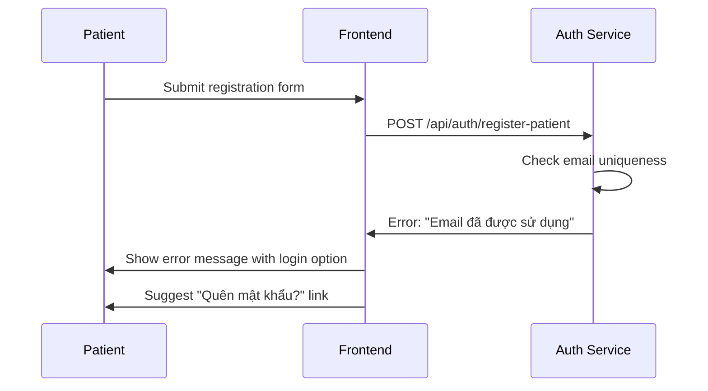
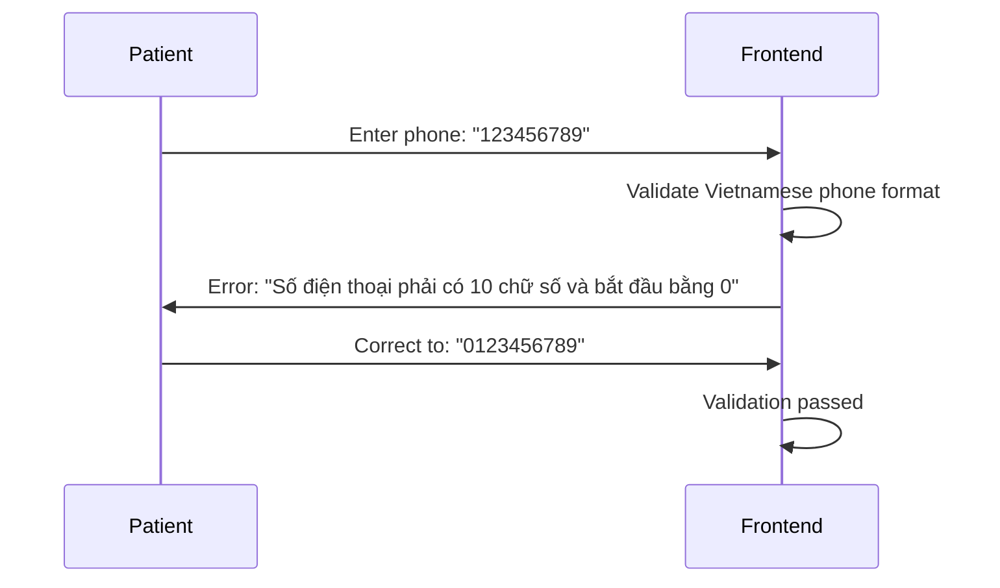
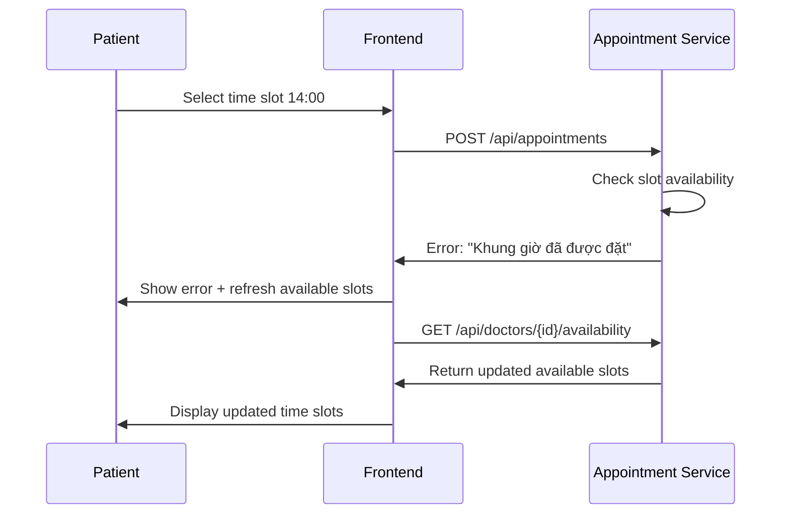
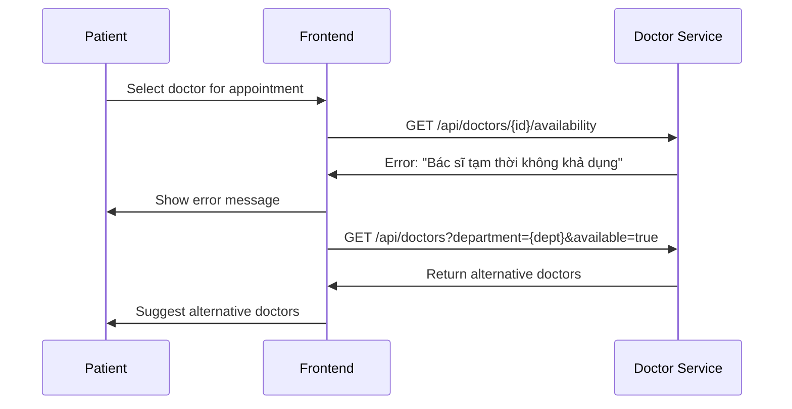
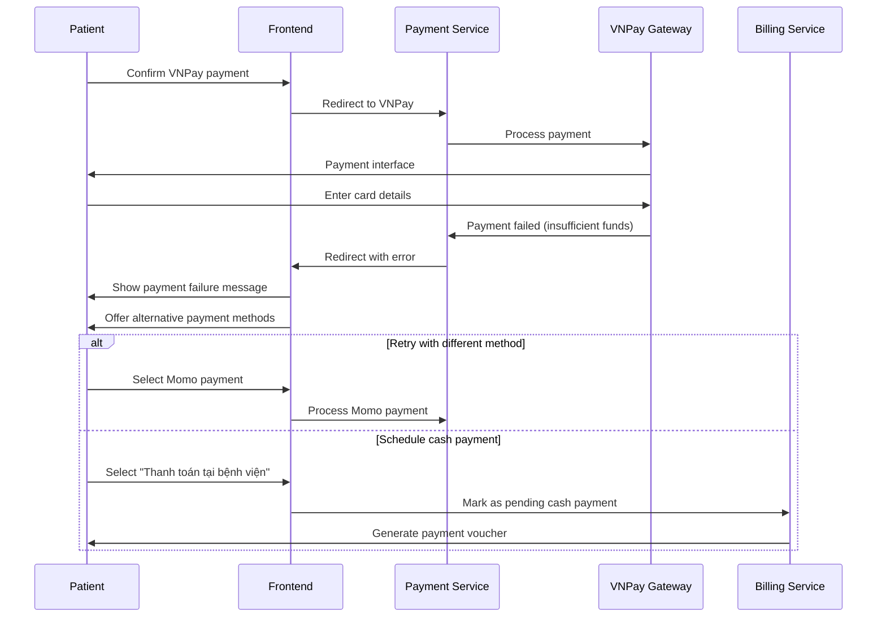
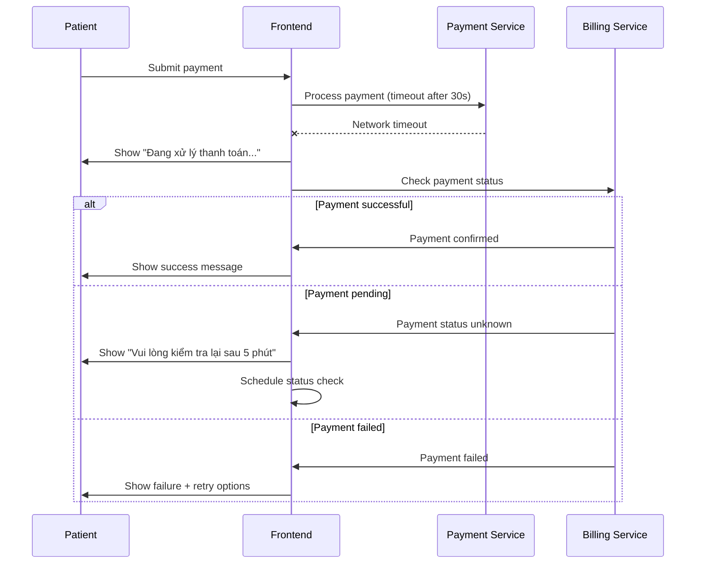
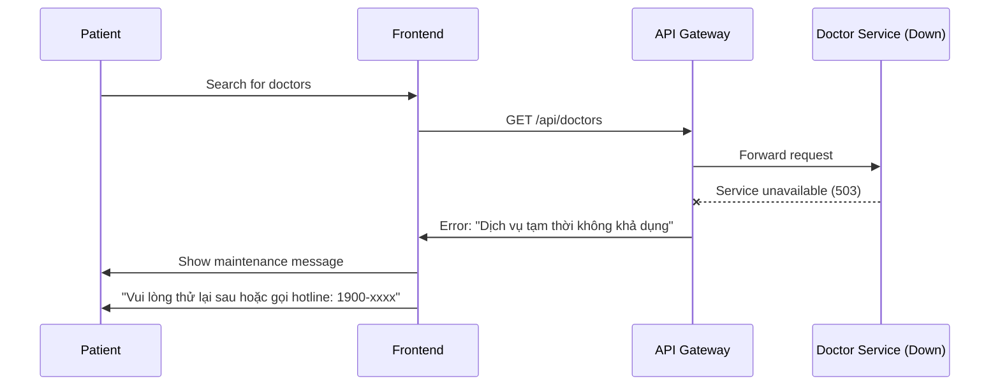

# 🏥 Complete Patient Journey Flow - Hospital Management System

**Date**: June 29, 2025  
**Version**: 1.0  
**Status**: Comprehensive Design Document

---

## 📋 **OVERVIEW**

This document provides a complete end-to-end patient journey flow in the Hospital Management System, from initial registration through appointment completion and payment. It includes detailed sequence diagrams, microservice interactions, and Vietnamese healthcare context considerations.

---

## 🎯 **PATIENT JOURNEY PHASES**

### **Phase 1: Registration & Authentication**

### **Phase 2: Appointment Booking**

### **Phase 3: Pre-Appointment Activities**

### **Phase 4: During Appointment**

### **Phase 5: Post-Appointment & Payment**

### **Phase 6: Follow-up Activities**

---

## 📊 **COMPLETE PATIENT JOURNEY SEQUENCE DIAGRAM**

```mermaid
sequenceDiagram
    participant P as Patient
    participant FE as Frontend App
    participant GW as API Gateway
    participant AUTH as Auth Service
    participant PAT as Patient Service
    participant DOC as Doctor Service
    participant APP as Appointment Service
    participant MED as Medical Records Service
    participant BILL as Billing Service
    participant NOTIF as Notification Service
    participant PAY as Payment Service
    participant EMAIL as Email Service
    participant SMS as SMS Service
    participant DB as Database

    Note over P,DB: PHASE 1: REGISTRATION & AUTHENTICATION

    P->>FE: Access hospital website
    FE->>P: Display homepage with registration option
    P->>FE: Click "Đăng ký bệnh nhân"
    FE->>P: Show registration form

    P->>FE: Fill registration details
    Note right of P: Full name, phone, email,<br/>date of birth, address,<br/>emergency contact, blood type

    FE->>FE: Client-side validation
    FE->>GW: POST /api/auth/register-patient
    GW->>AUTH: Forward registration request

    AUTH->>DB: Create user in Supabase Auth
    AUTH->>DB: Create profile record
    AUTH->>PAT: Create patient record via API Gateway
    PAT->>DB: Insert patient with PAT-YYYYMM-XXX ID

    AUTH->>EMAIL: Send verification email
    EMAIL->>P: Email verification link
    P->>EMAIL: Click verification link
    EMAIL->>AUTH: Verify email confirmation

    AUTH->>FE: Registration success response
    FE->>P: Show success message + login prompt

    Note over P,DB: PHASE 2: APPOINTMENT BOOKING

    P->>FE: Login with credentials
    FE->>GW: POST /api/auth/signin
    GW->>AUTH: Authenticate user
    AUTH->>FE: Return JWT token + user profile

    P->>FE: Navigate to "Đặt lịch khám"
    FE->>GW: GET /api/departments
    GW->>DOC: Get departments list
    DOC->>FE: Return departments with specialties

    P->>FE: Select department (e.g., "Tim mạch")
    FE->>GW: GET /api/doctors?department=DEPT001&specialty=Cardiology
    GW->>DOC: Get available doctors
    DOC->>FE: Return doctors with ratings & availability

    P->>FE: Select doctor (e.g., "BS. Nguyễn Văn A")
    FE->>GW: GET /api/doctors/{doctorId}/availability?date=2025-07-01
    GW->>DOC: Get doctor's schedule
    DOC->>APP: Check existing appointments
    APP->>DOC: Return booked slots
    DOC->>FE: Return available time slots

    P->>FE: Select time slot (e.g., "14:00-14:30")
    FE->>P: Show appointment confirmation form
    P->>FE: Confirm appointment details

    FE->>GW: POST /api/appointments
    GW->>APP: Create appointment
    APP->>DB: Insert appointment with CARD-APT-YYYYMM-XXX ID
    APP->>NOTIF: Send confirmation notifications

    NOTIF->>EMAIL: Send email confirmation to patient
    NOTIF->>SMS: Send SMS confirmation to patient
    NOTIF->>DOC: Notify doctor of new appointment

    APP->>FE: Return appointment confirmation
    FE->>P: Show booking success with appointment ID

    Note over P,DB: PHASE 3: PRE-APPOINTMENT ACTIVITIES

    Note right of NOTIF: 24 hours before appointment
    NOTIF->>EMAIL: Send reminder email
    NOTIF->>SMS: Send reminder SMS

    Note right of NOTIF: 2 hours before appointment
    NOTIF->>FE: Push notification (if app installed)
    NOTIF->>SMS: Send final reminder with check-in link

    P->>FE: Online check-in (30 min before)
    FE->>GW: POST /api/appointments/{id}/checkin
    GW->>APP: Update appointment status to "checked-in"
    APP->>NOTIF: Notify doctor patient has checked in

    Note over P,DB: PHASE 4: DURING APPOINTMENT

    Note right of DOC: Doctor starts consultation
    DOC->>GW: POST /api/appointments/{id}/start
    GW->>APP: Update status to "in-progress"
    APP->>NOTIF: Real-time update to patient

    DOC->>GW: GET /api/patients/{patientId}/medical-history
    GW->>MED: Retrieve patient medical records
    MED->>DOC: Return medical history

    Note right of DOC: Consultation and examination
    DOC->>GW: POST /api/medical-records
    GW->>MED: Create consultation record
    MED->>DB: Store diagnosis, symptoms, treatment plan

    alt Prescription needed
        DOC->>GW: POST /api/prescriptions
        GW->>MED: Create prescription
        MED->>DB: Store prescription details
        MED->>NOTIF: Send prescription to pharmacy
    end

    DOC->>GW: POST /api/appointments/{id}/complete
    GW->>APP: Update status to "completed"
    APP->>BILL: Trigger billing calculation

    Note over P,DB: PHASE 5: POST-APPOINTMENT & PAYMENT

    BILL->>DB: Calculate consultation fee + services
    BILL->>GW: POST /api/billing/invoices
    GW->>BILL: Create invoice
    BILL->>NOTIF: Send payment notification to patient

    NOTIF->>FE: Show payment notification
    P->>FE: Click "Thanh toán"
    FE->>GW: GET /api/billing/invoices/{invoiceId}
    GW->>BILL: Get invoice details
    BILL->>FE: Return itemized bill

    P->>FE: Select payment method
    alt VNPay Payment
        FE->>PAY: Redirect to VNPay gateway
        PAY->>P: VNPay payment interface
        P->>PAY: Complete payment
        PAY->>GW: Payment callback
        GW->>BILL: Update payment status
    else Momo Payment
        FE->>PAY: Redirect to Momo gateway
        PAY->>P: Momo payment interface
        P->>PAY: Complete payment
        PAY->>GW: Payment callback
        GW->>BILL: Update payment status
    else Cash Payment
        Note right of P: Payment at hospital counter
        BILL->>DB: Mark as "pending cash payment"
    end

    BILL->>EMAIL: Send payment receipt
    BILL->>FE: Payment confirmation
    FE->>P: Show payment success + receipt

    Note over P,DB: PHASE 6: FOLLOW-UP ACTIVITIES

    P->>FE: Access "Hồ sơ y tế"
    FE->>GW: GET /api/patients/{patientId}/medical-records
    GW->>MED: Get patient records
    MED->>FE: Return medical history timeline

    alt Prescription pickup
        P->>FE: View prescription details
        FE->>GW: GET /api/prescriptions/{prescriptionId}
        GW->>MED: Get prescription
        MED->>FE: Return prescription with pickup location
    end

    alt Follow-up appointment needed
        P->>FE: Book follow-up appointment
        Note right of P: Same process as Phase 2
    end

    P->>FE: Rate doctor experience
    FE->>GW: POST /api/doctors/{doctorId}/reviews
    GW->>DOC: Create review
    DOC->>DB: Store rating and feedback
    DOC->>NOTIF: Notify doctor of new review
```



---

## 🔍 **DETAILED PHASE BREAKDOWN**

### **PHASE 1: REGISTRATION & AUTHENTICATION**

#### **1.1 New Patient Registration Process**

**Current Implementation Status**: ✅ **COMPLETE**

**Flow Description**:

1. Patient accesses hospital website
2. Clicks "Đăng ký bệnh nhân" (Patient Registration)
3. Fills comprehensive registration form
4. System validates and creates account
5. Email verification sent and confirmed
6. Patient profile created with PAT-YYYYMM-XXX ID

**Microservices Involved**:

- **Auth Service**: User creation and authentication
- **Patient Service**: Patient record creation
- **Email Service**: Verification emails

**Vietnamese Healthcare Context**:

- Vietnamese phone number validation (10 digits, starts with 0)
- Vietnamese address format support
- Blood type selection (A, B, AB, O with Rh factor)
- Emergency contact requirements

#### **1.2 Existing Patient Login**

**Current Implementation Status**: ✅ **COMPLETE**

**Authentication Methods**:

- Email/Password login
- Phone/OTP login (planned)
- Social login (Google, Facebook) (planned)

---

### **PHASE 2: APPOINTMENT BOOKING**

#### **2.1 Department & Specialty Selection**

**Current Implementation Status**: ✅ **COMPLETE**

**Process**:

1. Display hospital departments with Vietnamese names
2. Show specialties within each department
3. Filter doctors by department and specialty

**Vietnamese Departments**:

- Tim mạch (Cardiology)
- Thần kinh (Neurology)
- Nhi khoa (Pediatrics)
- Sản phụ khoa (Obstetrics & Gynecology)
- Chấn thương chỉnh hình (Orthopedics)

#### **2.2 Doctor Selection & Availability**

**Current Implementation Status**: ✅ **COMPLETE**

**Features**:

- Doctor profiles with photos and credentials
- Patient ratings and reviews
- Real-time availability checking
- Consultation fees display

#### **2.3 Time Slot Booking**

**Current Implementation Status**: ✅ **COMPLETE**

**Process**:

1. Calendar interface showing available dates
2. Time slot selection (30-minute intervals)
3. Conflict checking and prevention
4. Appointment confirmation

---

### **PHASE 3: PRE-APPOINTMENT ACTIVITIES**

#### **3.1 Notification System**

**Current Implementation Status**: 🔄 **PARTIAL** (Basic notifications implemented)

**Missing Components**:

- SMS integration for Vietnamese carriers
- Push notifications for mobile app
- WhatsApp notifications (popular in Vietnam)

#### **3.2 Online Check-in**

**Current Implementation Status**: ❌ **MISSING**

**Required Implementation**:

- QR code check-in system
- Online queue management
- Estimated wait time display

---

### **PHASE 4: DURING APPOINTMENT**

#### **4.1 Consultation Workflow**

**Current Implementation Status**: ✅ **COMPLETE** (Backend ready)

**Process**:

1. Doctor starts consultation
2. Access patient medical history
3. Record consultation notes
4. Create treatment plan

#### **4.2 Medical Records Management**

**Current Implementation Status**: ✅ **COMPLETE** (Service ready)

**Features**:

- Real-time record creation
- Diagnosis coding (ICD-10)
- Treatment plan documentation
- Medical imaging integration (planned)

#### **4.3 Prescription Generation**

**Current Implementation Status**: 🔄 **PARTIAL** (Service exists, UI incomplete)

**Vietnamese Context**:

- Vietnamese drug database integration
- Prescription format compliance
- Pharmacy network integration

---

### **PHASE 5: POST-APPOINTMENT & PAYMENT**

#### **5.1 Billing Calculation**

**Current Implementation Status**: ✅ **COMPLETE**

**Features**:

- Automatic fee calculation
- Service itemization
- Insurance integration (planned)

#### **5.2 Vietnamese Payment Integration**

**Current Implementation Status**: ❌ **CRITICAL MISSING**

**Required Payment Methods**:

- **VNPay**: Most popular Vietnamese payment gateway
- **Momo**: Mobile wallet payment
- **ZaloPay**: Zalo ecosystem payment
- **Banking**: Direct bank transfer
- **Cash**: Traditional payment at counter

#### **5.3 Receipt Generation**

**Current Implementation Status**: ✅ **COMPLETE**

**Features**:

- Digital receipt via email
- PDF generation
- Tax invoice compliance (Vietnamese VAT)

---

### **PHASE 6: FOLLOW-UP ACTIVITIES**

#### **6.1 Medical Records Access**

**Current Implementation Status**: ✅ **COMPLETE**

**Features**:

- Patient portal access
- Medical history timeline
- Download medical reports

#### **6.2 Prescription Management**

**Current Implementation Status**: 🔄 **PARTIAL**

**Missing Features**:

- Pharmacy integration
- Prescription delivery tracking
- Medication reminders

#### **6.3 Doctor Rating System**

**Current Implementation Status**: ✅ **COMPLETE**

**Features**:

- 5-star rating system
- Written reviews
- Review verification
- Doctor response capability

---

## 🚨 **CRITICAL MISSING COMPONENTS**

### **1. Payment Service (Priority 1)**

- VNPay integration
- Momo wallet integration
- Payment gateway abstraction layer

### **2. Notification Service Enhancement (Priority 2)**

- SMS integration with Vietnamese carriers
- Push notification system
- WhatsApp Business API integration

### **3. Queue Management System (Priority 3)**

- Online check-in system
- Queue status tracking
- Wait time estimation

### **4. Mobile App Components (Priority 4)**

- React Native mobile application
- QR code scanning
- Offline capability

---

## 📱 **USER INTERFACE MOCKUPS**

### **Registration Form (Vietnamese)**

```
┌─────────────────────────────────────┐
│ 🏥 ĐĂNG KÝ BỆNH NHÂN               │
├─────────────────────────────────────┤
│ Họ và tên: [________________]       │
│ Số điện thoại: [________________]   │
│ Email: [________________]           │
│ Ngày sinh: [DD/MM/YYYY]            │
│ Giới tính: ○ Nam ○ Nữ ○ Khác       │
│ Nhóm máu: [Chọn nhóm máu ▼]        │
│ Địa chỉ: [________________]         │
│ Người liên hệ khẩn cấp:            │
│   Tên: [________________]           │
│   SĐT: [________________]           │
│                                     │
│ [☐] Tôi đồng ý với điều khoản      │
│                                     │
│     [ĐĂNG KÝ]    [HỦY BỎ]         │
└─────────────────────────────────────┘
```

### **Appointment Booking Interface**

```
┌─────────────────────────────────────┐
│ 📅 ĐẶT LỊCH KHÁM                   │
├─────────────────────────────────────┤
│ Bước 1: Chọn khoa                   │
│ ○ Tim mạch    ○ Thần kinh          │
│ ○ Nhi khoa    ○ Sản phụ khoa       │
│                                     │
│ Bước 2: Chọn bác sĩ                │
│ ┌─────────────────────────────────┐ │
│ │ 👨‍⚕️ BS. Nguyễn Văn A           │ │
│ │ Chuyên khoa: Tim mạch           │ │
│ │ ⭐ 4.8/5 (124 đánh giá)        │ │
│ │ Phí khám: 200,000 VNĐ          │ │
│ │         [CHỌN BÁC SĨ]          │ │
│ └─────────────────────────────────┘ │
│                                     │
│ Bước 3: Chọn thời gian             │
│ Ngày: [01/07/2025 ▼]               │
│ Giờ khám:                          │
│ ○ 08:00  ○ 08:30  ○ 09:00         │
│ ○ 14:00  ○ 14:30  ● 15:00         │
│                                     │
│     [XÁC NHẬN ĐẶT LỊCH]           │
└─────────────────────────────────────┘
```

### **Payment Interface (Vietnamese)**

```
┌─────────────────────────────────────┐
│ 💳 THANH TOÁN                      │
├─────────────────────────────────────┤
│ Hóa đơn: #CARD-APT-202507-001      │
│                                     │
│ Chi tiết:                          │
│ • Phí khám bệnh:     200,000 VNĐ   │
│ • Phí dịch vụ:        20,000 VNĐ   │
│ • VAT (10%):          22,000 VNĐ   │
│ ─────────────────────────────────── │
│ Tổng cộng:           242,000 VNĐ   │
│                                     │
│ Phương thức thanh toán:            │
│ ○ VNPay (Thẻ ATM/Internet Banking) │
│ ○ Momo (Ví điện tử)               │
│ ○ ZaloPay                          │
│ ● Tiền mặt tại bệnh viện           │
│                                     │
│     [THANH TOÁN]    [HỦY BỎ]      │
└─────────────────────────────────────┘
```

---

## ⚠️ **ERROR HANDLING SCENARIOS**

### **1. Registration Errors**

#### **Email Already Exists**



#### **Phone Number Validation Error**



### **2. Appointment Booking Errors**

#### **Time Slot Conflict**



#### **Doctor Unavailable**



### **3. Payment Processing Errors**

#### **VNPay Payment Failure**



#### **Network Timeout During Payment**



### **4. System Availability Errors**

#### **Microservice Down**



---

## 🔧 **IMPLEMENTATION ROADMAP FOR MISSING COMPONENTS**

### **Phase 1: Payment Integration (4-6 weeks)**

#### **Week 1-2: VNPay Integration**

1. **Setup VNPay Merchant Account**

   - Register with VNPay
   - Obtain merchant credentials
   - Setup sandbox environment

2. **Create Payment Service**

   ```bash
   # Create new microservice
   mkdir backend/services/payment-service
   cd backend/services/payment-service
   npm init -y
   npm install express vnpay-node crypto
   ```

3. **Implement VNPay Integration**
   - Payment request creation
   - Callback handling
   - Transaction verification
   - Refund processing

#### **Week 3-4: Momo Integration**

1. **Setup Momo Partnership**

   - Register Momo Business account
   - API credentials setup
   - Test environment configuration

2. **Implement Momo Payment Flow**
   - QR code generation
   - Deep link integration
   - Webhook handling
   - Transaction status checking

#### **Week 5-6: Payment UI & Testing**

1. **Frontend Payment Interface**

   - Payment method selection
   - Vietnamese payment forms
   - Error handling UI
   - Receipt display

2. **End-to-end Testing**
   - Payment flow testing
   - Error scenario testing
   - Performance testing
   - Security testing

### **Phase 2: Enhanced Notifications (2-3 weeks)**

#### **Week 1: SMS Integration**

1. **Vietnamese SMS Provider Setup**

   - Integrate with Viettel, Vinaphone, Mobifone
   - SMS template creation
   - Delivery status tracking

2. **SMS Service Implementation**
   ```javascript
   // SMS notification types
   const SMS_TEMPLATES = {
     APPOINTMENT_CONFIRMATION:
       "Xac nhan lich kham {appointmentId} vao {datetime}",
     APPOINTMENT_REMINDER: "Nhac nho: Ban co lich kham vao {datetime}",
     PAYMENT_SUCCESS:
       "Thanh toan thanh cong {amount}VND cho lich kham {appointmentId}",
   };
   ```

#### **Week 2-3: Push Notifications & WhatsApp**

1. **Push Notification Service**

   - Firebase Cloud Messaging setup
   - Device token management
   - Notification scheduling

2. **WhatsApp Business Integration**
   - WhatsApp Business API setup
   - Message templates approval
   - Automated messaging flow

### **Phase 3: Queue Management System (3-4 weeks)**

#### **Week 1-2: Online Check-in System**

1. **QR Code Generation**

   ```javascript
   // Generate unique QR code for each appointment
   const generateCheckInQR = (appointmentId) => {
     const checkInUrl = `${FRONTEND_URL}/checkin/${appointmentId}`;
     return QRCode.toDataURL(checkInUrl);
   };
   ```

2. **Check-in Process**
   - QR code scanning
   - Identity verification
   - Queue position assignment

#### **Week 3-4: Queue Management**

1. **Real-time Queue Tracking**

   - WebSocket implementation
   - Queue position updates
   - Wait time estimation

2. **Queue Display System**
   - Digital queue boards
   - Patient notification system
   - Doctor queue management

### **Phase 4: Mobile App Development (6-8 weeks)**

#### **Week 1-2: React Native Setup**

1. **Project Initialization**

   ```bash
   npx react-native init HospitalApp
   cd HospitalApp
   npm install @react-navigation/native
   npm install react-native-qrcode-scanner
   ```

2. **Core Navigation Structure**
   - Tab navigation
   - Stack navigation
   - Authentication flow

#### **Week 3-4: Core Features**

1. **Authentication Screens**

   - Login/Register
   - OTP verification
   - Biometric authentication

2. **Appointment Management**
   - Booking interface
   - Appointment list
   - QR code scanner

#### **Week 5-6: Advanced Features**

1. **Medical Records**

   - Records timeline
   - Document viewer
   - Prescription tracking

2. **Payment Integration**
   - Mobile payment methods
   - Payment history
   - Receipt management

#### **Week 7-8: Testing & Deployment**

1. **Testing**

   - Unit testing
   - Integration testing
   - User acceptance testing

2. **App Store Deployment**
   - iOS App Store submission
   - Google Play Store submission
   - App distribution

---

## 📊 **INTEGRATION POINTS WITH EXISTING MICROSERVICES**

### **Current Microservices Integration Status**

| Service                     | Integration Status | Missing Components     |
| --------------------------- | ------------------ | ---------------------- |
| **Auth Service**            | ✅ Complete        | 2FA, Social login      |
| **Patient Service**         | ✅ Complete        | Mobile app API         |
| **Doctor Service**          | ✅ Complete        | Real-time availability |
| **Appointment Service**     | ✅ Complete        | Queue management       |
| **Medical Records Service** | ✅ Complete        | Document storage       |
| **Billing Service**         | ✅ Complete        | Payment processing     |
| **Department Service**      | ✅ Complete        | -                      |
| **Notification Service**    | 🔄 Basic           | SMS, Push, WhatsApp    |

### **New Services Required**

1. **Payment Service** (Critical)

   - VNPay integration
   - Momo integration
   - Payment gateway abstraction

2. **Queue Management Service** (Important)

   - Check-in system
   - Queue tracking
   - Wait time calculation

3. **Document Service** (Nice to have)
   - File upload/download
   - Document versioning
   - Digital signatures

---

## 🎯 **VIETNAMESE HEALTHCARE CONTEXT CONSIDERATIONS**

### **Regulatory Compliance**

1. **Patient Data Protection**

   - Vietnamese Personal Data Protection Decree
   - Healthcare data encryption requirements
   - Audit trail maintenance

2. **Medical Practice Regulations**
   - Doctor licensing verification
   - Prescription format compliance
   - Medical record retention policies

### **Cultural Considerations**

1. **Language Support**

   - Vietnamese interface throughout
   - Medical terminology in Vietnamese
   - Support for ethnic minority languages

2. **Payment Preferences**

   - Cash payment still dominant
   - Mobile wallet adoption growing
   - Bank transfer popularity
   - Credit card usage limited

3. **Communication Preferences**
   - SMS still widely used
   - Zalo messaging popular
   - WhatsApp growing adoption
   - Email for formal communications

### **Technical Infrastructure**

1. **Internet Connectivity**

   - Mobile-first approach
   - Offline capability important
   - Low bandwidth optimization

2. **Device Compatibility**
   - Android dominance
   - Budget smartphone support
   - Feature phone consideration

---

This comprehensive patient journey flow and implementation roadmap provides everything needed to complete your hospital management system for graduation thesis defense. The focus should be on implementing the Payment Service first (VNPay integration) as it's the most critical missing component for achieving 10/10 score.
