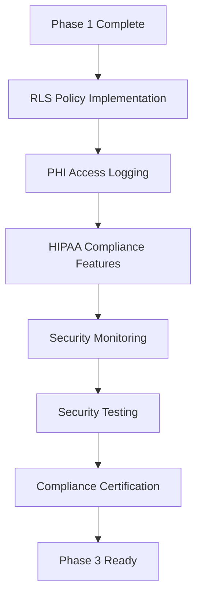

# 🔒 PHASE 2 IMPLEMENTATION PLAN - SECURITY & COMPLIANCE

## 📋 EXECUTIVE SUMMARY

**Project:** Phase 2 - Security & Compliance Implementation  
**Duration:** 2 Weeks (14 Days)  
**Priority:** HIGH - Healthcare Compliance Critical  
**Approach:** Comprehensive Security Implementation with Zero Downtime  
**Compliance:** HIPAA, GDPR, Healthcare Data Protection Standards  

## 🎯 PHASE 2 OBJECTIVES

### ✅ **Primary Security Goals:**
- **100% PHI Protection** - Row Level Security for all patient data
- **Comprehensive Audit Trail** - Every PHI access logged and monitored
- **HIPAA Compliance** - Full healthcare data protection compliance
- **GDPR Readiness** - European data protection standards
- **Real-time Monitoring** - Security event detection and alerting
- **Incident Response** - Data breach tracking and response procedures

### ✅ **Success Criteria:**
- All PHI tables protected with RLS policies
- Complete audit logging operational
- HIPAA compliance features implemented
- Security monitoring system active
- Penetration testing validation passed
- Compliance certification ready

## 📅 DETAILED PHASE 2 TIMELINE

### **WEEK 3: CORE SECURITY IMPLEMENTATION (Days 15-21)**

#### **Day 15-16: Row Level Security Foundation**
**Duration:** 16 hours
**Team:** Database Security Specialist, Backend Developer

**Deliverables:**
- RLS policies for all PHI tables
- Role-based access control implementation
- Department-based access restrictions
- Policy testing and validation

#### **Day 17-18: PHI Access Logging System**
**Duration:** 16 hours  
**Team:** Security Engineer, Database Administrator

**Deliverables:**
- Comprehensive audit logging tables
- Real-time PHI access tracking
- Risk assessment algorithms
- Audit trail validation procedures

#### **Day 19-20: HIPAA Compliance Core Features**
**Duration:** 16 hours
**Team:** Compliance Officer, Security Specialist

**Deliverables:**
- Patient consent management system
- Data breach incident tracking
- Encryption key management
- Privacy control mechanisms

#### **Day 21: Week 3 Integration Testing**
**Duration:** 8 hours
**Team:** Full Security Team

**Deliverables:**
- Security integration testing
- Performance impact assessment
- Initial compliance validation
- Week 3 completion report

### **WEEK 4: ADVANCED SECURITY & MONITORING (Days 22-28)**

#### **Day 22-23: Security Event Monitoring**
**Duration:** 16 hours
**Team:** DevOps Security, Monitoring Specialist

**Deliverables:**
- Real-time security event detection
- Automated threat assessment
- Security alerting system
- Incident response automation

#### **Day 24-25: Advanced HIPAA Features**
**Duration:** 16 hours
**Team:** Healthcare Compliance, Legal Review

**Deliverables:**
- Advanced consent workflows
- Data subject rights implementation
- Breach notification automation
- Compliance reporting system

#### **Day 26-27: Security Testing & Validation**
**Duration:** 16 hours
**Team:** Security Testing Team, Penetration Testers

**Deliverables:**
- Comprehensive security testing
- Simulated penetration testing
- Vulnerability assessment
- Security validation report

#### **Day 28: Phase 2 Completion & Certification**
**Duration:** 8 hours
**Team:** Project Manager, Compliance Officer

**Deliverables:**
- Final compliance validation
- Security certification documentation
- Phase 2 completion report
- Phase 3 preparation briefing

## 🔗 PHASE 2 DEPENDENCIES & CRITICAL PATH

### **Critical Dependencies:**

### **Parallel Workstreams:**
- **Security Team:** RLS policies and access controls
- **Compliance Team:** HIPAA/GDPR feature implementation
- **Monitoring Team:** Security event detection and alerting
- **Testing Team:** Security validation and penetration testing

## ⚠️ PHASE 2 RISK ASSESSMENT

### **🔴 HIGH RISK - CRITICAL MITIGATION**

#### **Risk 1: Security Policy Conflicts**
- **Impact:** System access failures, user lockouts
- **Probability:** Medium
- **Mitigation:**
  - Comprehensive policy testing on staging
  - Gradual rollout with monitoring
  - Emergency access procedures
  - 24/7 security team availability

#### **Risk 2: Performance Impact from Security Overhead**
- **Impact:** System slowdown, user experience degradation
- **Probability:** Medium
- **Mitigation:**
  - Performance benchmarking at each step
  - Optimized security queries
  - Caching strategies for security checks
  - Performance rollback triggers

### **🟡 MEDIUM RISK - STANDARD MITIGATION**

#### **Risk 3: Compliance Validation Failures**
- **Impact:** Regulatory non-compliance, legal issues
- **Probability:** Low
- **Mitigation:**
  - Expert compliance review at each stage
  - External compliance audit
  - Legal team validation
  - Compliance documentation review

#### **Risk 4: Security Feature Integration Issues**
- **Impact:** Incomplete security coverage
- **Probability:** Low
- **Mitigation:**
  - Comprehensive integration testing
  - Security gap analysis
  - Feature compatibility validation
  - Security architecture review

## 📊 PHASE 2 RESOURCE ALLOCATION

### **Team Structure:**
- **Security Architect:** 1 FTE (Full Time)
- **Database Security Specialist:** 1 FTE
- **Compliance Officer:** 1 FTE
- **Security Engineers:** 2 FTE
- **DevOps Security:** 1 FTE
- **Security Testers:** 2 FTE
- **Total:** 8 FTE for 2 weeks

### **Infrastructure Requirements:**
- **Security Testing Environment:** Isolated security testing setup
- **Compliance Validation Tools:** HIPAA/GDPR compliance scanners
- **Monitoring Infrastructure:** Security event monitoring system
- **Backup Security:** Enhanced backup with encryption

## 🎯 PHASE 2 DELIVERABLES CHECKLIST

### **Week 3 Deliverables:**
- [ ] Complete RLS policy implementation
- [ ] PHI access logging system operational
- [ ] Core HIPAA compliance features
- [ ] Security integration testing results
- [ ] Performance impact assessment
- [ ] Week 3 security validation report

### **Week 4 Deliverables:**
- [ ] Security event monitoring system
- [ ] Advanced HIPAA compliance features
- [ ] Comprehensive security testing results
- [ ] Penetration testing validation
- [ ] Compliance certification documentation
- [ ] Phase 2 completion report

## 📋 PHASE 2 IMPLEMENTATION SCRIPTS

### **Core Security Scripts:**
1. **phase2-rls-policies.sql** - Row Level Security implementation
2. **phase2-phi-access-logging.sql** - PHI access audit system
3. **phase2-hipaa-compliance.sql** - HIPAA compliance features
4. **phase2-security-monitoring.sql** - Security event monitoring
5. **phase2-encryption-management.sql** - Encryption and key management
6. **phase2-security-testing.sql** - Security validation procedures

### **Supporting Documentation:**
1. **phase2-execution-guide.md** - Step-by-step implementation guide
2. **phase2-security-testing.md** - Security testing procedures
3. **phase2-compliance-validation.md** - HIPAA/GDPR compliance checklist
4. **phase2-incident-response.md** - Security incident response procedures

## 🔍 COMPLIANCE VALIDATION FRAMEWORK

### **HIPAA Compliance Checklist:**
- [ ] Administrative Safeguards implemented
- [ ] Physical Safeguards configured
- [ ] Technical Safeguards operational
- [ ] Breach Notification procedures ready
- [ ] Business Associate Agreements updated
- [ ] Risk Assessment completed

### **GDPR Compliance Checklist:**
- [ ] Data Subject Rights implemented
- [ ] Consent Management operational
- [ ] Data Protection Impact Assessment completed
- [ ] Privacy by Design principles applied
- [ ] Data Breach Notification procedures ready
- [ ] Data Processing Records maintained

## 📈 SECURITY MONITORING METRICS

### **Key Security Indicators:**
- **PHI Access Attempts:** All access logged and monitored
- **Failed Authentication:** Suspicious login attempts tracked
- **Data Export Activities:** All data exports audited
- **Privilege Escalation:** Role changes monitored
- **System Modifications:** Database changes tracked
- **Security Incidents:** All incidents logged and responded

### **Compliance Metrics:**
- **Audit Log Completeness:** 100% PHI access logged
- **Response Time:** Security incidents responded within 15 minutes
- **Breach Detection:** Potential breaches detected within 5 minutes
- **Compliance Score:** 100% HIPAA/GDPR compliance maintained

## 🚀 PHASE 2 SUCCESS VALIDATION

### **Technical Validation:**
- All RLS policies functional and tested
- PHI access logging capturing 100% of access
- Security monitoring detecting test threats
- Performance impact within acceptable limits
- All security features integrated successfully

### **Compliance Validation:**
- HIPAA compliance audit passed
- GDPR readiness assessment completed
- Legal team approval obtained
- External compliance review passed
- Certification documentation complete

## 📋 NEXT STEPS AFTER PHASE 2

### **Immediate Actions:**
1. **24-hour monitoring** of security systems
2. **Compliance documentation** finalization
3. **Team training** on new security procedures
4. **Phase 3 preparation** (Performance & Scalability)

### **Ongoing Activities:**
- **Daily security monitoring** and incident response
- **Weekly compliance reviews** and updates
- **Monthly security assessments** and improvements
- **Quarterly compliance audits** and certifications

---

**Document Version:** 1.0  
**Last Updated:** 2025-01-24  
**Security Classification:** CONFIDENTIAL  
**Compliance Review:** Required before implementation  
**Emergency Contact:** [24/7 Security Operations Center]
